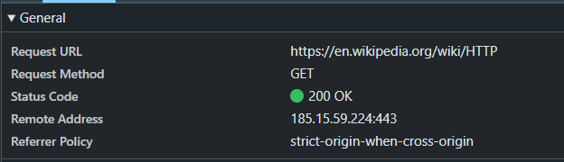
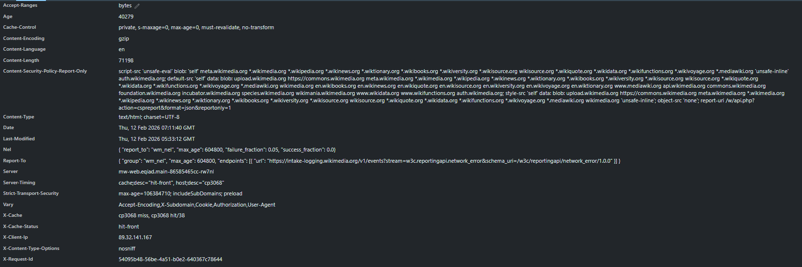
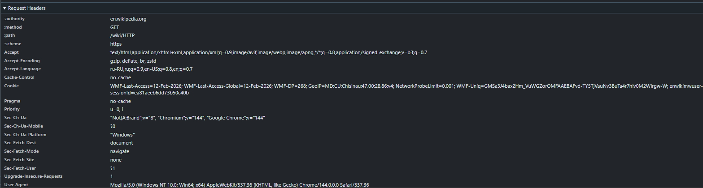
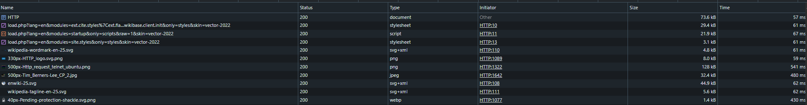
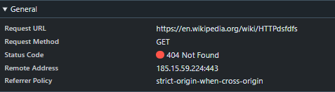
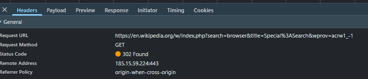
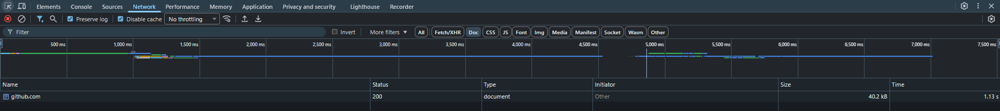
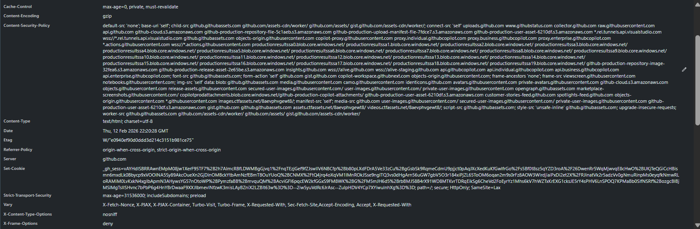
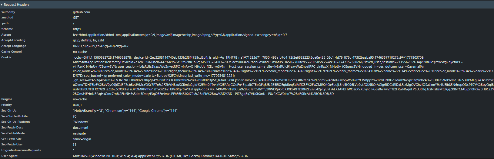

# Лабораторная работа №1 HTTP
Каварналы Анастасия IA2403

## Цель работы:

- Понять, что происходит, когда пользователь открывает сайт.
- Научиться находить и анализировать HTTP-запросы в браузере.
- Разобраться в назначении методов `GET`, `POST`, `PUT`, `DELETE`.

## Задание 1

### Анализ HTTP-запросов. Часть 1
### URL запроса
`https://en.wikipedia.org/wiki/HTTP`

### Метод запроса
`GET` — это HTTP-метод, используемый для запроса ресурса с сервера без изменения его состояния. `GET` используется, потому что при открытии сайта браузер просто запрашивает страницу у сервера — «покажи мне эту страницу». Никакие данные на сервере не создаются и не изменяются.

### Статус ответа
`200 OK` — запрос выполнен успешно, сервер вернул страницу.



### Заголовки запроса и ответа

#### Response Headers:



- `Cache-Control` — правила кэширования
- `Content-Encoding: gzip` — ответ сжат
- `Content-Type: text/html; charset=UTF-8` — тип возвращаемого контента (HTML)
- `Date` — время формирования ответа
- `Server` — серверное ПО (может быть скрыто/обобщено)
- `Strict-Transport-Security` — политика безопасности для HTTPS 

#### Request Headers:



- `:authority: en.wikipedia.org` — домен
- `:method: GET` — какой метод
- `:path: /wiki/HTTP` — путь ресурса
- `Accept` — какие типы данных браузер готов принять (HTML, картинки и т.д.)
- `Accept-Encoding` — список алгоритмов сжатия, которые поддерживает клиент 
(gzip, deflate, br, zstd и др.)
- `Accept-Language` — язык интерфейса/предпочтение языков
- `Cookie` — куки сессии/настроек 
- `User-Agent` — информация о браузере/ОС

### Есть ли тело запроса/ответа

- **Request body:** нет (обычно GET без тела)
- **Response body:** да — HTML-код страницы (видно во вкладке **Response** или **Preview**)

### Запросы при загрузке:



Помимо основного запроса типа `document` (HTTP), браузер автоматически отправляет дополнительные запросы:

- **Stylesheet (CSS)** — файлы стилей для оформления страницы  
  Пример: `load.php?...` (type: stylesheet)

- **Script (JavaScript)** — скрипты для динамики и интерактивности  
  Пример: `load.php?...` (type: script)

- **Images (PNG, JPG, SVG, WebP)** — изображения и иконки страницы  
  Примеры: `wikipedia-wordmark-en-25.svg`, `330px-HTTP_logo.svg.png`

- **SVG / Icons** — графические элементы интерфейса

Все эти ресурсы необходимы для:

- корректного отображения страницы;
- работы интерактивных элементов;
- загрузки изображений и иконок.

## Ошибочный URL: 
`https://en.wikipedia.org/wiki/HTTPdsfdfs`

### Что получилось
- Request Method: `GET`
- Status Code: `404 Not Found`

### Почему 404?
Ресурс с таким путём **не существует** на сервере, поэтому сервер сообщает “не найдено”.




## Задание 2

### Анализ HTTP-запросов. Часть 2

1. Страница: `https://en.wikipedia.org/wiki/Special:Search`

2. Выполнить поиск по слову: `browser`

3. Изучите следующие аспекты:

 - URL запроса:
`https://en.wikipedia.org/w/index.php?search=browser&title=Special%3ASearch&wprov=acrw1_-1`

- Метод: `GET`. Поиск запускается как **запрос страницы результатов** (параметры передаются в URL)

- Query Parameters:
  - `search=browser` — поисковое слово. Сервер понимает, что нужно искать слово “browser”
  - `title=Special%3ASearch` — служебная страница, которая обрабатывает поиск
  `%3A` = символ `:` → получается `Special:Search` 
  - `wprov=acrw1_-1` — служебный параметр Википедии, связанный с источником/типом запроса



## Задание 3

### Анализ HTTP-запросов. Часть 3

Выбранный сайт: `https://github.com`

### 1. Основной запрос страницы: 



### URL запроса
`https://github.com/`


### Метод запроса
`GET` — это HTTP-метод, используемый для запроса ресурса с сервера без изменения его состояния

### Статус ответа
`200 OK` — запрос выполнен успешно, сервер вернул страницу

### 2. Заголовки запроса и ответа

#### Response Headers



Ключевые заголовки:

- `Cache-Control` — говорит браузеру, можно ли хранить страницу/файлы в кэше и на сколько, или нужно каждый раз проверять заново
- `Content-Encoding: gzip` — ответ сжат
- `Content-Security-Policy` — политика безопасности контента
- `Content-Type: text/html; charset=utf-8` — говорит браузеру, что именно пришло (здесь HTML) и в какой кодировке
- `Set-Cookie` — сервер установил cookie
- `Strict-Transport-Security` — заставляет браузер всегда открывать сайт только по HTTPS, даже если кто-то попробует HTTP

#### Request Headers:



Ключевые заголовки:
- `:authority` — какому сайту отправляем запрос (домен)
- `:method` — что мы делаем ( GET =“дай мне страницу/данные” )
- `:path` — какую конкретно страницу/путь хотим на этом сайте
- `Accept` — говорит серверу, какие форматы браузер умеет принимать (HTML, картинки и т.д.)
- `Accept-Encoding` — поддерживаемые сжатия (gzip, br, zstd)
- `Accept-Language` — предпочитаемые языки
- `Cookie` — то, что браузер уже хранит для этого сайта (сессия, настройки) и отправляет обратно
- `User-Agent` — информация о браузере и ОС

### 3. Есть ли тело запроса или ответа?

- **Request body:** нет (GET-запрос обычно без тела)
- **Response body:** да — HTML-код страницы (видно во вкладке `Response` или `Preview`)

### 4. Какие ещё запросы были отправлены при загрузке и почему?

При загрузке страницы, кроме основного `document`, браузер догружает:
- **CSS (stylesheet)** — оформление страницы
- **JS (script)** — интерактивность и динамика
- **Images/SVG/WebP** — изображения и иконки
- **Fonts** — шрифты
- **Fetch** — дополнительные данные для интерфейса

Эти запросы нужны, чтобы страница выглядела правильно и работала (кнопки, меню, динамические блоки).

## Задание 4
### Составление HTTP-запросов

### 1. GET-запрос к http://sandbox.usm.com с User-Agent

```http
GET / HTTP/1.1
Host: sandbox.usm.com
User-Agent: Cavarnali Anastasia
Accept: */*
Connection: close
```
####  Что такое User-Agent и для чего он используется?

**User-Agent** — это заголовок HTTP-запроса, который сообщает серверу, какой клиент отправляет запрос (браузер, Postman, приложение), иногда с версией и ОС

**Для чего используется:**
- статистика и аналитика;
- совместимость (сервер может отдавать разный контент под разные устройства/браузеры);
- фильтрация/безопасность (ограничение ботов и подозрительных клиентов)

### 2. POST-запрос к http://sandbox.usm.com/cars с параметрами:
- `make` — марка автомобиля (например, `BMW`)
- `model` — модель автомобиля (например, `X3`)
- `year` — год выпуска (например, `2025`)

```http
POST /cars HTTP/1.1
Host: sandbox.usm.com
User-Agent: Cavarnali Anastasia
Content-Type: application/x-www-form-urlencoded

make=BMW&model=X3&year=2025
```

####  Какие еще методы HTTP-запросов существуют и для чего они используются?

- **GET** — получить данные (чтение)
- **POST** — создать ресурс / отправить данные
- **PUT** — полностью заменить ресурс (полное обновление)
- **PATCH** — частично обновить ресурс (изменить только переданные поля)
- **DELETE** — удалить ресурс
- **HEAD** — как GET, но без тела ответа (только заголовки)
- **OPTIONS** — узнать, какие методы разрешены 

### 3. PUT-запрос к серверу по адресу http://sandbox.usm.com/cars/1

 ```http
PUT /cars/1 HTTP/1.1
Host: sandbox.usm.com
User-Agent: Cavarnali Anastasia
Content-Type: application/json

{
  "make": "BMW",
  "model": "X3",
  "year": 2025
}
```

####  В чем разница между PATCH и PUT запросами?

- **PUT** — полная замена ресурса.  
  Обычно отправляют **весь объект целиком**, и сервер перезаписывает ресурс полностью.  
  Если какое-то поле не передать, оно может **сброситься/пропасть** (зависит от API).

- **PATCH** — частичное обновление ресурса.  
  Отправляют **только те поля, которые нужно изменить**, остальные поля остаются без изменений.

### 4. Возможный ответ сервера на мой POST-запрос + когда вернутся коды 200/201/400/401/403/404/500

Мой запрос :

```http
POST /cars HTTP/1.1
Host: sandbox.usm.com
Content-Type: application/json
User-Agent: Cavarnali Anastasia
Accept: application/json
Connection: close

{
  "make": "BMW",
  "model": "X3",
  "year": 2025
}
```

Один из возможных вариантов ответа сервера (пример: 201 Created) :

```http
HTTP/1.1 201 Created
Content-Type: application/json
Location: /cars/<id>

{
  "id": "<id>",
  "make": "BMW",
  "model": "X3",
  "year": 2025
}
```

### Предположите ситуации, когда сервер может вернуть HTTP-коды 200, 201, 400, 401, 403, 404, 500

- **200 OK** — запрос обработан успешно и сервер вернул результат 
- **201 Created** — ресурс (машина) успешно создан, сервер может вернуть созданный объект и/или ссылку на него (`Location`).
- **400 Bad Request** — запрос некорректный: отсутствуют обязательные параметры (`make`, `model`, `year`), `year`
- **401 Unauthorized** — требуется авторизация (токен/логин)
- **403 Forbidden** — доступ запрещен: авторизация есть, но нет прав на создание ресурса
- **404 Not Found** — адрес не найден (`/cars` или `Host` неправильные)
- **500 Internal Server Error** — внутренняя ошибка сервера (сбой БД, баг в коде, необработанное исключение)


