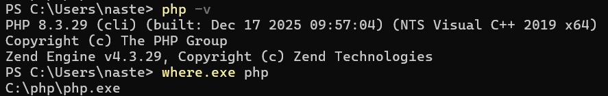
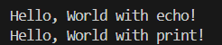

# Лабораторная работа №2. Установка и первая программа на PHP
Каварналы Анастасия IA2403

## Цель работы

 Установка и настройка среды разработки для работы с языком программирования PHP, а также создание первой программы на PHP

## Шаг 1: Установка PHP
Я выбрала 1 вариант установки PHP

### 1. Скачивание и распаковка
 1. Перешла на официальный сайт PHP: `https://www.php.net/downloads`
 2. Скачала актуальную версию PHP для Windows
 3. Распаковала архив в удобное место:  
   **`C:\php`**

### 2. Добавление PHP в переменную среды Path
 1. Нажала `Win + R` → ввела `sysdm.cpl` → Enter
 2. Вкладка **Дополнительно** → **Переменные среды**
 3. В разделе **Системные переменные** выбрала `Path` → **Изменить**
 4. Добавила путь: **`C:\php`**
 5. Сохранила изменения

### 3. Проверка установки
Открыла терминал и выполнила:

```bat
php -v
```

```bat
where.exe php
```
   

## Шаг 2: Альтернативный способ установки PHP (XAMPP)

**Не выполнялся**, так как выбран вариант установки PHP через `Шаг 1`

## Шаг 3: Написание первой PHP-программы

### 1. Создание проекта

1. Папка проекта (Lab2):  
`C:\Users\naste\OneDrive\Документы\PHP\Lab2`

2. Создан файл:  
`index.php`

3. Вставила код 

 ```php
   <?php

   echo "Привет, мир!";
   ```

#### Проверка вывода в терминале:

Для проверки работы скрипта запустила в терминале командой:

```bat
php index.php
```

   

#### Проверка вывода в браузере:

Для просмотра результата в браузере запустила встроенный веб-сервер PHP и открыла страницу по адресу:
`http://localhost:3000/`

   

## Шаг 4: Вывод данных в PHP

1. Вывела строку "Hello, World!" используя функцию `echo` и `print`.

   ```php
   echo "Hello, World with echo!";
   print "Hello, World with print!";
   ```

#### Проверка вывода в терминале:

Для проверки работы скрипта запустила в терминале командой:

```bat
php index.php
```

   

#### Проверка вывода в браузере:

Для просмотра результата в браузере запустила встроенный веб-сервер PHP и открыла страницу по адресу:
`http://localhost:3000/`

   

## Шаг 5. Работа с переменными и выводом

1. Создала две переменные:
   - Целочисленную переменную `$days` со значением `288`
   - Строковую переменную `$message` с текстом: `Все возвращаются на работу!`
2. Вывела значения переменных на экран несколькими способами:
   - С использованием конкатенации. *Конкатенация* - это объединение строк, в PHP используется оператор `.`:
   - С использованием двойных кавычек
3. Использовала переход на новую строку в выводе используя тэг `<br />`

 ```php
<?php
$days = 288;
$message = "Все возвращаются на работу!";

echo "Конкатенация: " . $days . " — " . $message . "<br />";
echo "Двойные кавычки: $days — $message<br />";
```

#### Проверка вывода в терминале:

Для проверки работы скрипта запустила в терминале командой:

```bat
php index.php
```

   

#### Проверка вывода в браузере:

Для просмотра результата в браузере запустила встроенный веб-сервер PHP и открыла страницу по адресу:
`http://localhost:3000/`

   

## Контрольные вопросы

### 1. Какие способы установки PHP существуют?

- **Скачать PHP отдельно** (архив / installer), распаковать в папку (например `C:\php`) и добавить путь в **PATH** : `Win + R → sysdm.cpl` → **Дополнительно** → **Переменные среды** → **Path** → Добавить `C:\php` → Ок

- **Установить готовый пакет** (например XAMPP/WAMP/MAMP) — там уже есть PHP + веб-сервер (Apache) и инструменты

- **Через Docker/WSL** — когда нужно отдельное окружение в контейнере/подсистеме

### 2. Как проверить, что PHP установлен и работает?

- В терминале выполнить команду:

  ```bat
  php -v
  ```
Если вывелась версия — PHP установлен

- Проверить, откуда запускается PHP (путь к php.exe):

   ```bat
   where.exe php
   ```

- Запустить файл: 

   ```bat
   php index.php
   ```

Если выводится результат без ошибок — PHP работает

### 3. Чем отличается `echo` от `print`?

- Оба выводят текст

- `echo` обычно используют чаще: он проще и может выводить несколько значений

- `print` выводит одно значение и дополнительно возвращает `1` как результат выполнения
