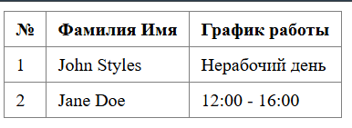

# Лабораторная работа №3. Управляющие конструкции
Каварналы Анастасия, IA2403

## Цель работы

Освоить использование условных конструкций и циклов в PHP

## Задание
1. С помощью `date()` сформировать таблицу расписания на основе текущего дня недели:
   - **John Styles**: Пн/Ср/Пт → `8:00-12:00`, иначе → `Нерабочий день`
   - **Jane Doe**: Вт/Чт/Сб → `12:00-16:00`, иначе → `Нерабочий день`
2. Для цикла `for` вывести промежуточные значения `$a` и `$b` на каждом шаге
3. Переписать этот цикл с использованием `while` и `do-while`
4. Ответить на контрольные вопросы

## Ход работы:
### 1. Условные конструкции

```php
<?php
$day = date('N');

if ($day == 1 || $day == 3 || $day == 5) {
    $johnSchedule = "8:00 - 12:00";
} else {
    $johnSchedule = "Нерабочий день";
}

if ($day == 2 || $day == 4 || $day == 6) {
    $janeSchedule = "12:00 - 16:00";
} else {
    $janeSchedule = "Нерабочий день";
}
?>

<style>
table {
    border-collapse: collapse;
}
th, td {
    padding: 6px 10px;
    text-align: left;
}
</style>

<table border="1" cellpadding="0" cellspacing="0">
    <tr>
        <th>№</th>
        <th>Фамилия Имя</th>
        <th>График работы</th>
    </tr>
    <tr>
        <td>1</td>
        <td>John Styles</td>
        <td><?= $johnSchedule ?></td>
    </tr>
    <tr>
        <td>2</td>
        <td>Jane Doe</td>
        <td><?= $janeSchedule ?></td>
    </tr>
</table>
```

**Результат:**



## 2. Циклы
### 2.1. Цикл `for`

```php
<?php
$a = 0;
$b = 0;

for ($i = 0; $i <= 5; $i++) {
    $a += 10;
    $b += 5;
    echo "Шаг $i: a = $a, b = $b <br>";
}

echo "Конец for-цикла!";
```

**Вывод:**
```
Шаг 0: a = 10, b = 5
Шаг 1: a = 20, b = 10
Шаг 2: a = 30, b = 15
Шаг 3: a = 40, b = 20
Шаг 4: a = 50, b = 25
Шаг 5: a = 60, b = 30
Конец for-цикла!
```

### 2.2. Цикл `while`

```php
<?php
$a = 0;
$b = 0;
$i = 0;

while ($i <= 5) {
    $a += 10;
    $b += 5;
    echo "Шаг $i: a = $a, b = $b <br>";
    $i++;
}

echo "Конец while-цикла!";
?>
```

**Результат:**

```
Шаг 0: a = 10, b = 5
Шаг 1: a = 20, b = 10
Шаг 2: a = 30, b = 15
Шаг 3: a = 40, b = 20
Шаг 4: a = 50, b = 25
Шаг 5: a = 60, b = 30
Конец for-цикла!
```

### 2.3. Цикл `do-while`

```php
<?php
$a = 0;
$b = 0;
$i = 0;

do {
    $a += 10;
    $b += 5;
    echo "Шаг $i: a = $a, b = $b <br>";
    $i++;
} while ($i <= 5);

echo "Конец do-while-цикла!";
?>
```

**Результат:**

```
Шаг 0: a = 10, b = 5
Шаг 1: a = 20, b = 10
Шаг 2: a = 30, b = 15
Шаг 3: a = 40, b = 20
Шаг 4: a = 50, b = 25
Шаг 5: a = 60, b = 30
Конец do-while-цикла!
```

В этих трех примерах (**for**, **while**, **do-while**) результат одинаковый, потому что цикл выполняется **6 раз (0–5)** и каждый раз делает **a + 10** и **b + 5**, поэтому в конце **a = 60**, **b = 30**

## Контрольные вопросы

### 1. В чем разница между for, while и do-while? Когда какой использовать?

- **for** - удобно, когда заранее известно количество повторений (есть счётчик)
- **while** - удобно, когда повторяем “пока условие верно” и число повторов заранее неизвестно
- **do-while** - как while, но тело выполнится минимум **1 раз**, потому что проверка условия после выполнения

### 2.  Как работает тернарный оператор `? :` в PHP?

Тернарный оператор `?`: - это короткий if/else

`(условие) ? значение_если_да : значение_если_нет;`

**Как работает:**

- если условие верно -> берется часть после ?

- если условие неверно -> берется часть после : 

### 3. Что произойдет, если в `do-while` поставить условие, которое изначально ложно?

Тело `do-while` выполнится один раз, а потом цикл остановится, потому что проверка условия происходит после выполнения

## Вывод
 В ходе данной работы я повторила работу с циклами **for**, **while** и **do-while** в PHP и вывела промежуточные значения переменных на каждом шаге. Я увидела, что при одинаковом условии и одинаковых действиях все три цикла дают один и тот же результат, а различаются только способом записи и моментом проверки условия: в **for** и **while** условие проверяется до выполнения, а в **do-while** — после, поэтому он выполняется минимум один раз
