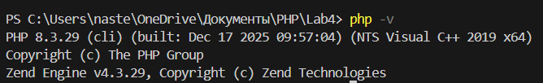
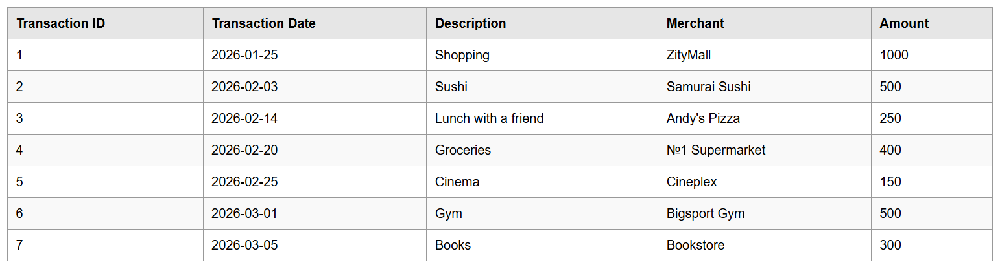
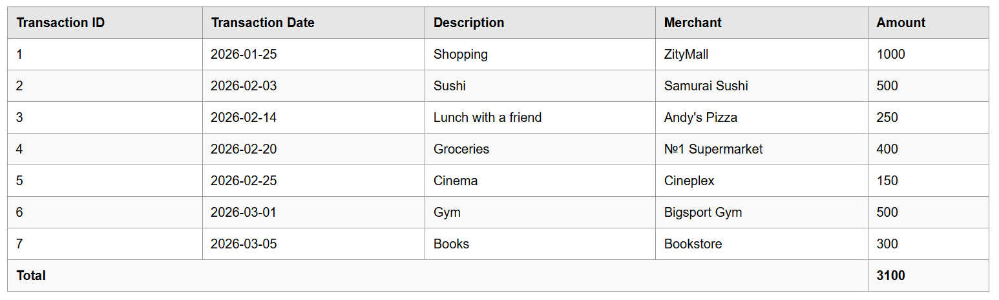
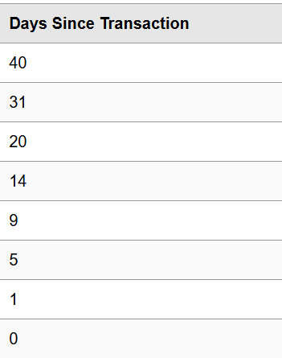
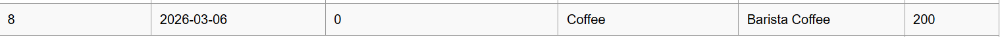
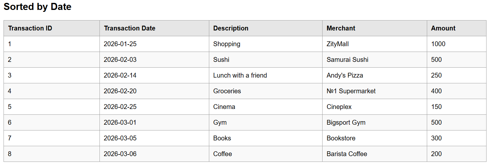
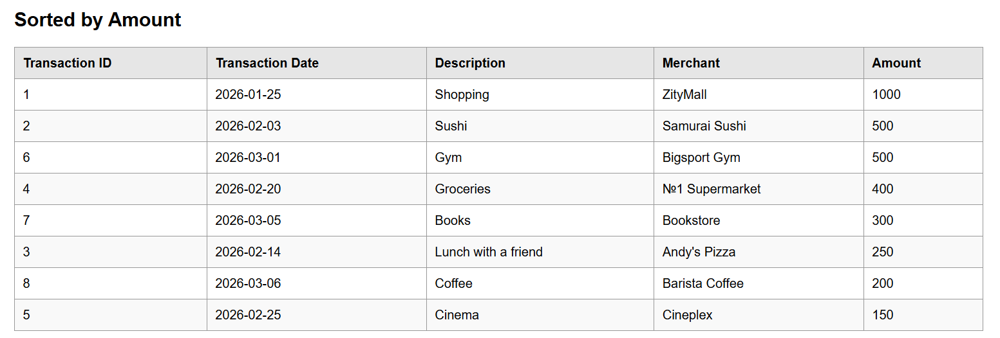
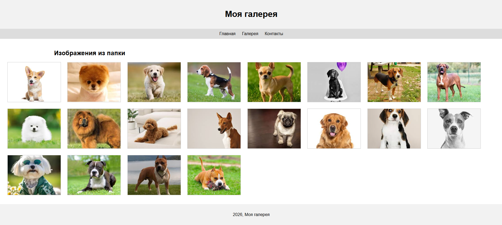

# Лабораторная работа №4.  Массивы и Функции
Каварналы Анастасия, IA2403

## Цель работы

Освоить работу с массивами в PHP, применяя различные операции: создание, добавление, удаление, сортировки

## Условия

**Задание 1.** Разработать систему управления банковскими транзакциями с возможностью:

- добавления новых транзакций;
- удаления транзакций;
- сортировки транзакций по дате или сумме;
- поиска транзакций по описанию

**Задание 2.** Работа с файловой системой

Создать папку `image` с 20–30 изображениями `.jpg`, файл `index.php` и вывести изображения на страницу в виде галереи с хедером, меню, контентом и футером

## Ход работы

### Задание 1.1. Подготовка среды

1. Установлен PHP версии 8+


2. Создан файл `index.php`
3. Включена строгая типизация:

   ```php
   <?php

   declare(strict_types=1);
   ```

### Задание 1.2. Создание массива транзакций

Создала массив `$transactions`, содержащий информацию о банковских транзакциях. Каждая транзакция представлена в виде ассоциативного массива с полями:

- `id` – уникальный идентификатор транзакции;

- `date` – дата совершения транзакции (YYYY-MM-DD);

- `amount` – сумма транзакции;

- `description` – описание назначения платежа;

- `merchant` – название организации, получившей платеж

```php 
$transactions = [
    [
        "id" => 1,
        "date" => "2026-01-25",
        "amount" => 1000.00,
        "description" => "Shopping",
        "merchant" => "ZityMall",
    ],
    [
        "id" => 2,
        "date" => "2026-02-03",
        "amount" => 500.00,
        "description" => "Sushi",
        "merchant" => "Samurai Sushi",
    ],
    [
        "id" => 3,
        "date" => "2026-02-14",
        "amount" => 250.00,
        "description" => "Lunch with a friend",
        "merchant" => "Andy's Pizza",
    ],
    [
        "id" => 4,
        "date" => "2026-02-20",
        "amount" => 400.00,
        "description" => "Groceries",
        "merchant" => "№1 Supermarket",
    ],
    [
        "id" => 5,
        "date" => "2026-02-25",
        "amount" => 150.00,
        "description" => "Cinema",
        "merchant" => "Cineplex",
    ],
    [
        "id" => 6,
        "date" => "2026-03-01",
        "amount" => 500.00,
        "description" => "Gym",
        "merchant" => "Bigsport Gym",
    ],
    [
        "id" => 7,
        "date" => "2026-03-05",
        "amount" => 300.00,
        "description" => "Books",
        "merchant" => "Bookstore",
    ],
];
```
### 1.3. Вывод списка транзакций (foreach + HTML-таблица)

```php
<!DOCTYPE html>
<html lang="en">
<head>
    <meta charset="UTF-8">
    <title>Transactions</title>
    <style>
        body {
            font-family: Arial, sans-serif;
        }

        table {
            border-collapse: collapse;
            width: 80%;
            margin: 20px auto;
        }

        th, td {
            border: 1px solid #999;
            padding: 10px;
            text-align: left;
        }

        th {
            background-color: #e6e6e6;
        }

        tr:nth-child(even) {
            background-color: #f9f9f9;
        }

        tr:hover {
            background-color: #f1f1f1;
        }
    </style>
</head>
<body>

<table>
    <thead>
        <tr>
            <th>Transaction ID</th>
            <th>Transaction Date</th>
            <th>Description </th>
            <th>Merchant </th>
            <th>Amount</th>
        </tr>
    </thead>
    <tbody>
        <?php foreach ($transactions as $transaction) { ?>
            <tr>
                <td><?php echo $transaction["id"]; ?></td>
                <td><?php echo $transaction["date"]; ?></td>
                <td><?php echo $transaction["description"]; ?></td>
                <td><?php echo $transaction["merchant"]; ?></td>
                <td><?php echo $transaction["amount"]; ?></td>
            </tr>
        <?php } ?>
    
    </tbody>
</table>

</body>
</html>
```



### Задание 1.4. Реализация функций

#### 1. Функция `calculateTotalAmount(array $transactions): float`

Функция вычисляет общую сумму всех транзакций

Выводим сумму всех транзакций в конце таблицы.

```php
function calculateTotalAmount(array $transactions): float
{
    $total = 0;

    foreach ($transactions as $transaction) {
        $total += $transaction["amount"];
    }

    return $total;
}

$totalAmount = calculateTotalAmount($transactions);
```

Полученная сумма должна быть выведена в конце HTML-таблицы

```html
<tr>
    <td colspan="5"><strong>Total</strong></td>
    <td><strong><?php echo $totalAmount; ?></strong></td>
</tr>
```


#### 2. Функция `findTransactionByDescription(string $descriptionPart)`

Функция выполняет поиск транзакции по части описания

```php 
function findTransactionByDescription(string $descriptionPart): ?array
{
    global $transactions;

    foreach ($transactions as $transaction) {
        if (stripos($transaction["description"], $descriptionPart) !== false) {
            return $transaction;
        }
    }

    return null;
}
```

Пример использования:

```php
$foundByDescription = findTransactionByDescription("Cinema");

if ($foundByDescription !== null) {
    echo $foundByDescription["description"];
} else {
    echo "Transaction not found";
}
```


#### 3. Функция `findTransactionById(int $id): ?array`  через  `foreach`

Функция ищет транзакцию по идентификатору с использованием цикла `foreach`.

```php
function findTransactionById(int $id): ?array
{
    global $transactions;

    foreach ($transactions as $transaction) {
        if ($transaction["id"] === $id) {
            return $transaction;
        }
    }

    return null;
}
```

Пример использования:

```php
$foundById = findTransactionById(2);

if ($foundById !== null) {
    echo $foundById["description"];
} else {
    echo "Transaction not found";
}
```


#### Функция `findTransactionByIdWithFilter(int $id): ?array` через `array_filter`

Функция ищет транзакцию по идентификатору с использованием `array_filter`

```php
function findTransactionByIdWithFilter(int $id): ?array
{
    global $transactions;

    $filteredTransactions = array_filter($transactions, function ($transaction) use ($id) {
        return $transaction["id"] === $id;
    });

    if (empty($filteredTransactions)) {
        return null;
    }

    return array_values($filteredTransactions)[0];
}
```

Пример использования:

```php
$foundByIdWithFilter = findTransactionByIdWithFilter(1);

if ($foundByIdWithFilter !== null) {
    echo $foundByIdWithFilter["description"];
} else {
    echo "Transaction not found";
}
```


#### 4. Функция `daysSinceTransaction(string $date): int`

Функция возвращает количество дней между датой транзакции и текущим днем

```php
function daysSinceTransaction(string $date): int
{
    $transactionDate = new DateTime($date);
    $currentDate = new DateTime('today');

    $difference = $currentDate->diff($transactionDate);

    return $difference->days;
}
```

Вывод в таблице:

```php
<td><?php echo daysSinceTransaction($transaction["date"]); ?></td>
```



#### 5. Функция `addTransaction(int $id, string $date, float $amount, string $description, string $merchant): void`

Создаем функцию `addTransaction(int $id, string $date, float $amount, string $description, string $merchant): void` для добавления новой транзакции

Массив `$transactions` используется внутри функции как глобальная переменная

```php
function addTransaction(int $id, string $date, float $amount, string $description, string $merchant): void
{
    global $transactions;

    $transactions[] = [
        "id" => $id,
        "date" => $date,
        "amount" => $amount,
        "description" => $description,
        "merchant" => $merchant,
    ];
}
```

Пример использования:

```php
addTransaction(8, "2026-03-06", 200.00, "Coffee", "Barista Coffee");
```



#### 6. Функция `removeTransactionById(int $id): void`

Функция удаляет транзакцию по идентификатору.

```php
function removeTransactionById(int $id): void
{
    global $transactions;

    foreach ($transactions as $key => $transaction) {
        if ($transaction["id"] === $id) {
            unset($transactions[$key]);
        }
    }

    $transactions = array_values($transactions);
}
```

Пример использования:

```php
removeTransactionById(3);
```

Для проверки результата можно выполнить поиск удаленной транзакции:

```php
$deletedTransaction = findTransactionById(3);

if ($deletedTransaction === null) {
    echo "Transaction deleted successfully";
} else {
    echo "Transaction was not deleted";
}
```


### Задание 1.5. Сортировка транзакций 
1. Сортировка транзакций по дате с использованием usort()

```php
usort($transactions, function (array $a, array $b): int {
    return strtotime($a['date']) <=> strtotime($b['date']);
});
```



2. Сортировка транзакций по сумме (по убыванию)

```php
usort($transactions, function (array $a, array $b): int {
    return $b['amount'] <=> $a['amount'];
});
```


### Задание 2. Работа с файловой системой

1. Создала директорию "image", в которой сохранила 20 изображений с расширением `.jpg`

2. Затем создала файл `index.php`, в котором определила веб-страницу с хедером, меню, контентом и футером

3. Вывела изображения из директории "image" на веб-страницу в виде галереи

```php
<?php
declare(strict_types=1);

$folder = 'image/';
$files = scandir($folder);
$images = [];

foreach ($files as $file) {
    if ($file != '.' && $file != '..') {
        $extension = strtolower(pathinfo($file, PATHINFO_EXTENSION));

        if ($extension == 'jpg' || $extension == 'jpeg') {
            $images[] = $file;
        }
    }
}
?>
<!DOCTYPE html>
<html lang="ru">
<head>
    <meta charset="UTF-8">
    <title>Галерея</title>
    <style>
        body {
            margin: 0;
            font-family: Arial, sans-serif;
            background-color: #f5f5f5;
        }

        header {
            background-color: #333;
            color: white;
            text-align: center;
            padding: 20px;
        }

        nav {
            background-color: #555;
            text-align: center;
            padding: 10px;
        }

        nav a {
            color: white;
            text-decoration: none;
            margin: 0 15px;
        }

        main {
            padding: 20px;
        }

        h2, p {
            text-align: center;
        }

        .gallery {
            display: flex;
            flex-wrap: wrap;
            gap: 15px;
            justify-content: center;
        }

        .gallery img {
            width: 200px;
            height: 150px;
            object-fit: cover;
            border: 1px solid #ccc;
            border-radius: 6px;
        }

        footer {
            background-color: #333;
            color: white;
            text-align: center;
            padding: 15px;
            margin-top: 20px;
        }
    </style>
</head>
<body>

<header>
    <h1>Моя галерея</h1>
</header>

<nav>
    <a href="#">Главная</a>
    <a href="#">Галерея</a>
    <a href="#">О нас</a>
    <a href="#">Контакты</a>
</nav>

<main>
    <h2>Галерея изображений</h2>
    <p>Найдено: <?php echo count($images); ?> изображений</p>

    <div class="gallery">
        <?php foreach ($images as $image) { ?>
            " alt="Image">
        <?php } ?>
    </div>
</main>

<footer>
    <p>2026 Моя галерея</p>
</footer>

</body>
</html>
```



## Контрольные вопросы

### 1.Что такое массивы в PHP?

**Массивы в PHP** — это структура данных для хранения нескольких значений в одной переменной

### 2. Каким образом можно создать массив в PHP?

Массив в PHP можно создать с помощью квадратных скобок `[]` или функции `array()`

```
$numbers = [1, 2, 3];
```
```
$numbers = array(1, 2, 3);
```

### 3. Для чего используется цикл `foreach`?

Цикл `foreach` используется для перебора элементов массива. Он по очереди берет каждое значение из массива и позволяет выполнить с ним нужное действие, например вывести на экран

