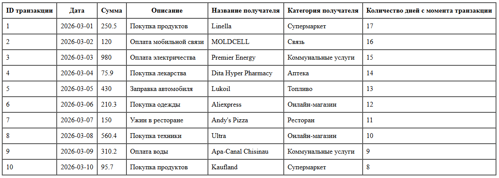

# Лабораторная работа №5 Объектно-ориентированное программирование в PHP
Каварналы Анастасия IA2403

## Цель работы:

Освоить основы объектно-ориентированного программирования в PHP на практике. Научиться создавать собственные классы, использовать инкапсуляцию для защиты данных, разделять ответственность между классами, а также применять интерфейсы для построения гибкой архитектуры приложения

## Условия

Необходимо реализовать систему управления банковскими транзакциями, которая должна включать следующие компоненты:

- `Transaction` - класс, описывающий одну банковскую транзакцию

- `TransactionRepository` - класс для хранения транзакций

- `TransactionManager` - класс бизнес-логики для обработки транзакций

- `TransactionTableRenderer` - класс для отображения транзакций в HTML-таблице

- `TransactionStorageInterface` - интерфейс для обеспечения гибкости архитектуры

Также необходимо:

- создать не менее 10 транзакций;

- добавить их в репозиторий;

- вывести данные в HTML-таблицу;

- документировать код с помощью PHPDoc

## Ход работы

**Задание 1.** Включение строгой типизации

В начале файла включила строгую типизацию:

```php
<?php

declare(strict_types=1);
```

**Задание 2.** Класс `Transaction`

Был создан класс `Transaction`, который описывает одну банковскую транзакцию

**Свойства:**

- `id` - уникальный идентификатор транзакции;

- `date` - дата транзакции;

- `amount` - сумма транзакции;

- `description` - описание платежа;

- `merchant` - получатель платежа

```php
class Transaction
{
    public function __construct(
        private int $id,
        private DateTime $date,
        private float $amount,
        private string $description,
        private string $merchant
    ) {
    }

    public function getId(): int
    {
        return $this->id;
    }

    public function getDate(): DateTime
    {
        return $this->date;
    }

    public function getAmount(): float
    {
        return $this->amount;
    }

    public function getDescription(): string
    {
        return $this->description;
    }

    public function getMerchant(): string
    {
        return $this->merchant;
    }

    public function getDaysSinceTransaction(): int
    {
        $currentDate = new DateTime();

        return (int) $this->date->diff($currentDate)->days;
    }
}
```

Метод `getDaysSinceTransaction()` вычисляет количество дней с момента транзакции до текущей даты

**Задание 3.** Класс `TransactionRepository`

Был создан класс `TransactionRepository`, который управляет коллекцией транзакций

В классе создан приватный массив `$transactions`, в котором хранятся объекты Transaction

**Реализованы методы:**

- `addTransaction(Transaction $transaction): void` - добавление новой транзакции;

- `removeTransactionById(int $id): void` - удаление транзакции по идентификатору;

- `getAllTransactions(): array` - возврат полного списка транзакций;

- `findById(int $id): ?Transaction` - поиск транзакции по идентификатору

```php
class TransactionRepository implements TransactionStorageInterface
{
    private array $transactions = [];

    public function addTransaction(Transaction $transaction): void
    {
        $this->transactions[] = $transaction;
    }

    public function removeTransactionById(int $id): void
    {
        foreach ($this->transactions as $index => $transaction) {
            if ($transaction->getId() === $id) {
                unset($this->transactions[$index]);
                break;
            }
        }

        $this->transactions = array_values($this->transactions);
    }

    public function getAllTransactions(): array
    {
        return $this->transactions;
    }

    public function findById(int $id): ?Transaction
    {
        foreach ($this->transactions as $transaction) {
            if ($transaction->getId() === $id) {
                return $transaction;
            }
        }

        return null;
    }
}
```

**Задание 4.** Класс `TransactionManager`

Был создан класс `TransactionManager`, который отвечает за бизнес-логику работы с транзакциями

Класс не хранит транзакции внутри себя, а получает доступ к хранилищу через конструктор

**Реализованы методы:**

- `calculateTotalAmount(): float` - вычисление общей суммы всех транзакций;

- `calculateTotalAmountByDateRange(string $startDate, string $endDate): float` - вычисление суммы за указанный период;

- `countTransactionsByMerchant(string $merchant): int` - подсчет количества транзакций по получателю;

- `sortTransactionsByDate(): Transaction[]` - сортировка транзакций по дате;

- `sortTransactionsByAmountDesc(): Transaction[]` - сортировка транзакций по сумме по убыванию

```php
class TransactionManager
{
    public function __construct(
        private TransactionStorageInterface $repository
    ) {
    }

    public function calculateTotalAmount(): float
    {
        $total = 0.0;

        foreach ($this->repository->getAllTransactions() as $transaction) {
            $total += $transaction->getAmount();
        }

        return $total;
    }

    public function calculateTotalAmountByDateRange(string $startDate, string $endDate): float
    {
        $total = 0.0;
        $start = new DateTime($startDate);
        $end = new DateTime($endDate);

        foreach ($this->repository->getAllTransactions() as $transaction) {
            $transactionDate = $transaction->getDate();

            if ($transactionDate >= $start && $transactionDate <= $end) {
                $total += $transaction->getAmount();
            }
        }

        return $total;
    }

    public function countTransactionsByMerchant(string $merchant): int
    {
        $count = 0;

        foreach ($this->repository->getAllTransactions() as $transaction) {
            if ($transaction->getMerchant() === $merchant) {
                $count++;
            }
        }

        return $count;
    }

    public function sortTransactionsByDate(): array
    {
        $transactions = $this->repository->getAllTransactions();

        usort($transactions, function (Transaction $a, Transaction $b): int {
            return $a->getDate()->getTimestamp() <=> $b->getDate()->getTimestamp();
        });

        return $transactions;
    }

    public function sortTransactionsByAmountDesc(): array
    {
        $transactions = $this->repository->getAllTransactions();

        usort($transactions, function (Transaction $a, Transaction $b): int {
            return $b->getAmount() <=> $a->getAmount();
        });

        return $transactions;
    }
}
```

**Задание 5.** Класс `TransactionTableRenderer`

Был создан отдельный класс для вывода транзакций в виде HTML-таблицы

**Реализованы методы:**

- `render(array $transactions): string` - принимает массив транзакций и возвращает строку с HTML-кодом таблицы

```php
final class TransactionTableRenderer
{
    public function render(array $transactions): string
    {
        $html = '<table border="1" cellpadding="8" cellspacing="0">';
        $html .= '<tr>';
        $html .= '<th>ID транзакции</th>';
        $html .= '<th>Дата</th>';
        $html .= '<th>Сумма</th>';
        $html .= '<th>Описание</th>';
        $html .= '<th>Название получателя</th>';
        $html .= '<th>Категория получателя</th>';
        $html .= '<th>Количество дней с момента транзакции</th>';
        $html .= '</tr>';

        foreach ($transactions as $transaction) {
            $html .= '<tr>';
            $html .= '<td>' . $transaction->getId() . '</td>';
            $html .= '<td>' . $transaction->getDate()->format('Y-m-d') . '</td>';
            $html .= '<td>' . $transaction->getAmount() . '</td>';
            $html .= '<td>' . $transaction->getDescription() . '</td>';
            $html .= '<td>' . $transaction->getMerchant() . '</td>';
            $html .= '<td>' . $this->getMerchantCategory($transaction->getMerchant()) . '</td>';
            $html .= '<td>' . $transaction->getDaysSinceTransaction() . '</td>';
            $html .= '</tr>';
        }

        $html .= '</table>';

        return $html;
    }

    private function getMerchantCategory(string $merchant): string
    {
        return match ($merchant) {
            'Linella', 'Kaufland' => 'Супермаркет',
            'Orange', 'Moldcell' => 'Связь',
            'Aliexpress', 'Ultra' => 'Онлайн-магазин',
            'Lukoil' => 'Топливо',
            'Premier Energy', 'Apa-Canal Chisinau' => 'Коммунальные услуги',
            'Dita Hyper Pharmacy' => 'Аптека',
            'Andy\'s Pizza' => 'Ресторан',
            default => 'Другое',
        };
    }
}
```

**Задание 6.** Создание начальных данных

Было создано 10 объектов `Transaction` с разными датами, суммами, описаниями и получателями

**Транзакция должна содержать:**

- разные даты;

- разные суммы;

- разные описания;

- разных получателей

```php
$repository = new TransactionRepository();

$transaction1 = new Transaction(1, new DateTime('2026-03-01'), 250.50, 'Покупка продуктов', 'Linella');
$transaction2 = new Transaction(2, new DateTime('2026-03-02'), 120.00, 'Оплата мобильной связи', 'Moldcell');
$transaction3 = new Transaction(3, new DateTime('2026-03-03'), 980.00, 'Оплата электричества', 'Premier Energy');
$transaction4 = new Transaction(4, new DateTime('2026-03-04'), 75.90, 'Покупка лекарства', 'Dita Hyper Pharmacy');
$transaction5 = new Transaction(5, new DateTime('2026-03-05'), 430.00, 'Заправка автомобиля', 'Lukoil');
$transaction6 = new Transaction(6, new DateTime('2026-03-06'), 210.30, 'Покупка одежды', 'Aliexpress');
$transaction7 = new Transaction(7, new DateTime('2026-03-07'), 150.00, 'Ужин в ресторане', 'Andy\'s Pizza');
$transaction8 = new Transaction(8, new DateTime('2026-03-08'), 560.40, 'Покупка техники', 'Ultra');
$transaction9 = new Transaction(9, new DateTime('2026-03-09'), 310.20, 'Оплата воды', 'Apa-Canal Chisinau');
$transaction10 = new Transaction(10, new DateTime('2026-03-10'), 95.70, 'Покупка продуктов', 'Kaufland');

$repository->addTransaction($transaction1);
$repository->addTransaction($transaction2);
$repository->addTransaction($transaction3);
$repository->addTransaction($transaction4);
$repository->addTransaction($transaction5);
$repository->addTransaction($transaction6);
$repository->addTransaction($transaction7);
$repository->addTransaction($transaction8);
$repository->addTransaction($transaction9);
$repository->addTransaction($transaction10);
```

**Задание 7.** Интерфейс `TransactionStorageInterface`

Для повышения гибкости архитектуры был создан интерфейс `TransactionStorageInterface`

**Интерфейс содержит методы:**

1. `addTransaction(Transaction $transaction): void`

2. `removeTransactionById(int $id): void`

3. `getAllTransactions(): array`

4. `findById(int $id): ?Transaction`

- `TransactionRepository` реализует этот интерфейс;

- `TransactionManager` получает через конструктор не конкретный класс, а интерфейс, что делает архитектуру более гибкой

```php
interface TransactionStorageInterface
{
    public function addTransaction(Transaction $transaction): void;

    public function removeTransactionById(int $id): void;

    public function getAllTransactions(): array;

    public function findById(int $id): ?Transaction;
}
```

После изменения конструктор `TransactionManager`

```php
public function __construct(
    private TransactionStorageInterface $repository
) {
}
```

**Вывод результата на страницу**

Для вывода таблицы был создан объект `TransactionTableRenderer` и вызван метод `render()`

```php
$renderer = new TransactionTableRenderer();

echo $renderer->render($repository->getAllTransactions());
```



## Контрольные вопросы

### 1. Зачем нужна строгая типизация в PHP и как она помогает при разработке?

**Строгая типизация** нужна, чтобы PHP лучше проверял типы данных и раньше показывал ошибки. Это делает код надежнее и понятнее

### 2. Что такое класс в объектно-ориентированном программировании и какие основные компоненты класса вы знаете?

**Класс** — это шаблон, по которому создаются объекты. Он описывает, какие данные будет хранить объект и какие действия он сможет выполнять

**Основные компоненты класса:**

- свойства — хранят данные объекта;

- методы — выполняют действия с этими данными;

- конструктор — задает начальные значения при создании объекта;

- модификаторы доступа (`public`, `private`, `protected`) — определяют, откуда можно обращаться к свойствам и методам

### 3. Объясните, что такое полиморфизм и как он может быть реализован в PHP.

**Полиморфизм** — это когда один и тот же код может работать с разными классами. В PHP это часто делается через интерфейсы или наследование

### 4. Что такое интерфейс в PHP и как он отличается от абстрактного класса?

**Интерфейс** — это набор методов, которые класс обязан реализовать

Отличие от абстрактного класса в том, что `интерфейс` задает только правила, а `абстрактный класс` может еще содержать готовый код и свойства

### 5. Какие преимущества дает использование интерфейсов при проектировании архитектуры приложения? Объясните на примере данной лабораторной работы.

Интерфейсы делают программу гибче. В данной работе `TransactionManager` работает не с конкретным `TransactionRepository`, а с интерфейсом `TransactionStorageInterface`. Поэтому при желании можно заменить одно хранилище другим, не меняя бизнес-логику

## Вывод

В ходе данной работы были изучены основы объектно-ориентированного программирования в PHP. Были созданы классы для описания транзакций, их хранения, обработки и вывода в таблицу. Также был использован интерфейс, который сделал структуру программы более гибкой и понятной. В результате была реализована простая система управления банковскими транзакциями с применением строгой типизации и принципов ООП

## Используемые источники 

1. [PHP Manual — The Basics of Classes](https://www.php.net/manual/ru/language.oop5.basic.php)  
   Официальная документация PHP по базовому синтаксису классов
2. [PHP Manual — DateTime](https://www.php.net/manual/ru/class.datetime.php)  
   Официальная документация PHP по классу `DateTime`
3. [PHP Manual — DateTimeInterface::diff](https://www.php.net/manual/ru/datetime.diff.php)  
   Официальная документация PHP по вычислению разницы между датами
4. [PHP Manual — Object Interfaces](https://www.php.net/manual/ru/language.oop5.interfaces.php)  
   Официальная документация PHP по интерфейсам
5. [Reference](https://docs.phpdoc.org/guide/references/phpdoc/index.html),
   [Basic Syntax](https://docs.phpdoc.org/guide/references/phpdoc/basic-syntax.html)  
   Официальная документация по PHPDoc
