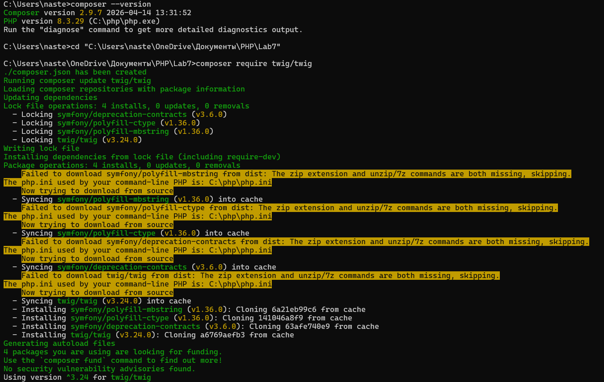

# Лабораторная работа №7 Шаблонизация
Каварналы Анастасия IA2403

## Цель работы

Освоить принципы шаблонизации в PHP, как с использованием нативных PHP-шаблонов, так и с применением готового шаблонизатора. Улучшить структуру проекта, разделив логику обработки данных и представление

## Задание

В рамках лабораторной работы необходимо было доработать проект из `лабораторной работы №6` и выполнить следующие задачи:

- разделить проект на две части: логику и представление;
- вынести обработку данных, валидацию, чтение и сохранение записей в отдельные PHP-файлы;
- оформить вывод данных через отдельные нативные PHP-шаблоны;
- установить и настроить шаблонизатор Twig с помощью Composer;
- реализовать тот же функционал с использованием Twig-шаблонов;
- использовать возможности Twig для более удобной структуры шаблонов, включая наследование и блоки;
- создать собственный Twig-фильтр, который решает практическую задачу в проекте

## Структура проекта

```bash
Lab7/
├── src/
│   ├── functions.php # вспомогательные функции
│   ├── twig.php # настройка Twig
│   ├── ValidatorInterface.php # интерфейс валидатора
│   └── StudySessionValidator.php # проверка данных формы 
├── templates/ # содержит шаблоны для отображения страниц
│   ├── layout.php # общий шаблон страницы
│   ├── form.php # форма ввода данных
│   ├── list.php # отображение списка записей
│   └── errors.php # вывод ошибок
├── templates_twig/ 
│   ├── layout.twig # общий Twig-шаблон
│   ├── form.twig # форма на Twig
│   ├── list.twig # список записей на Twig
│   └── errors.twig # вывод ошибок на Twig
├── index.php # страница с формой (PHP)
├── list_sessions.php # список записей (PHP) 
├── save_session.php # обработка и сохранение данных (PHP)
├── index_twig.php # форма на Twig
├── list_sessions_twig.php # список записей на Twig
├── save_session_twig.php # сохранение данных на Twig
├── data.json # файл хранения данных
├── styles.css # стили
├── composer.json # зависимости проекта
└── vendor/ # установленные библиотеки
```

## Ход работы

### 1. Точки входа приложения

На первом этапе были оформлены основные файлы, через которые открываются страницы проекта.
В проекте есть две версии: первая работает с нативными PHP-шаблонами, вторая — с Twig

#### 1.1 Главная страница на нативных PHP-шаблонах

Файл `index.php` отвечает за открытие формы добавления учебного занятия:

```php
<?php

require_once __DIR__ . '/src/functions.php';

render('form', [
    'title' => 'Трекер учебных сессий'
]);
```

В этом файле подключается `src/functions.php`, после чего вызывается функция `render()`

HTML-код формы больше не находится в `index.php`, а подключается из шаблона `templates/form.php`

#### 1.2. Страница со списком записей на PHP

Файл `list_sessions.php` отвечает за вывод сохранённых занятий:

```php
<?php

require_once __DIR__ . '/src/functions.php';

$sort = $_GET['sort'] ?? 'study_date';
$sessions = getSortedSessions($sort);

render('list', [
    'title' => 'Список учебных занятий',
    'sessions' => $sessions,
    'sort' => $sort
]);
```

Здесь из адресной строки берётся параметр сортировки `sort`

Если параметр не указан, записи сортируются по дате занятия

После этого данные передаются в шаблон `templates/list.php`

#### 1.3. Обработка формы на PHP

Файл `save_session.php` принимает данные из формы, проверяет их и сохраняет новую запись:

```php
<?php

require_once __DIR__ . '/src/functions.php';
require_once __DIR__ . '/src/StudySessionValidator.php';

if ($_SERVER['REQUEST_METHOD'] !== 'POST') {
    header('Location: index.php');
    exit;
}

$validator = new StudySessionValidator();
$errors = $validator->validate($_POST);

if (!empty($errors)) {
    render('errors', [
        'title' => 'Ошибки',
        'errors' => $errors
    ]);
    exit;
}

$session = prepareSessionData($_POST);
saveSession($session);

header('Location: list_sessions.php');
exit;
```

Сначала проверяется, что запрос был отправлен методом `POST`.
Затем создаётся объект валидатора и выполняется проверка данных.
Если есть ошибки, открывается шаблон `errors.php`.
Если ошибок нет, данные подготавливаются через `prepareSessionData()`, сохраняются в `data.json`, после чего пользователь перенаправляется на страницу списка

#### 1.4. Главная страница на Twig

Файл `index_twig.php` открывает ту же форму, но уже через Twig:

```php
<?php

require_once __DIR__ . '/src/twig.php';

echo $twig->render('form.twig');
```

Здесь подключается файл настройки Twig, после чего вызывается метод `render()` для шаблона `form.twig`

#### 1.5. Страница списка на Twig

Файл `list_sessions_twig.php` выводит список занятий через Twig-шаблон:

```php
<?php

require_once __DIR__ . '/src/functions.php';
require_once __DIR__ . '/src/twig.php';

$sort = $_GET['sort'] ?? 'study_date';
$sessions = getSortedSessions($sort);

echo $twig->render('list.twig', [
    'sessions' => $sessions,
    'sort' => $sort
]);
```

Логика получения и сортировки данных остаётся такой же, как в PHP-версии.
Отличие только в том, что для отображения используется Twig-шаблон `list.twig`

#### 1.6. Обработка формы на Twig

Файл `save_session_twig.php` выполняет ту же задачу, что и `save_session.php`, но ошибки выводятся через Twig:

```php
<?php

require_once __DIR__ . '/src/functions.php';
require_once __DIR__ . '/src/twig.php';
require_once __DIR__ . '/src/StudySessionValidator.php';

if ($_SERVER['REQUEST_METHOD'] !== 'POST') {
    header('Location: index_twig.php');
    exit;
}

$validator = new StudySessionValidator();
$errors = $validator->validate($_POST);

if (!empty($errors)) {
    echo $twig->render('errors.twig', [
        'errors' => $errors
    ]);
    exit;
}

$session = prepareSessionData($_POST);
saveSession($session);

header('Location: list_sessions_twig.php');
exit;
```

При успешном сохранении происходит переход на `list_sessions_twig.php`.
Если данные не проходят проверку, пользователь видит список ошибок через шаблон `errors.twig`

### 2. Общие функции проекта

Основные функции вынесены в файл `src/functions.php`

#### 2.1. Получение пути к файлу данных

```php
function getDataFilePath(): string
{
    return __DIR__ . '/../data.json';
}
```

Эта функция возвращает путь к файлу `data.json`.
Так путь хранится в одном месте, и его не нужно повторять в разных файлах

#### 2.2. Чтение записей

```php
function readSessions(): array
{
    $file = getDataFilePath();

    if (!file_exists($file)) {
        return [];
    }

    $content = file_get_contents($file);
    $decoded = json_decode($content, true);

    return is_array($decoded) ? $decoded : [];
}
```

Функция читает данные из `data.json`.
Если файла нет или данные не удалось преобразовать в массив, возвращается пустой массив

#### 2.3. Сохранение записи

```php
function saveSession(array $session): void
{
    $data = readSessions();
    $data[] = $session;

    file_put_contents(
        getDataFilePath(),
        json_encode($data, JSON_PRETTY_PRINT | JSON_UNESCAPED_UNICODE)
    );
}
```

Функция сначала получает уже существующие записи, затем добавляет новую и сохраняет обновлённый массив обратно в `data.json`

#### 2.4. Подготовка данных формы

```php
function prepareSessionData(array $postData): array
{
    return [
        'subject' => trim($postData['subject'] ?? ''),
        'study_date' => trim($postData['study_date'] ?? ''),
        'duration' => (int)($postData['duration'] ?? 0),
        'difficulty' => trim($postData['difficulty'] ?? ''),
        'result' => trim($postData['result'] ?? ''),
        'notes' => trim($postData['notes'] ?? ''),
        'created_at' => date('Y-m-d H:i:s'),
    ];
}
```

**Эта функция подготавливает данные перед сохранением:**

- убирает лишние пробелы;
- приводит длительность к числу;
- добавляет дату и время создания записи

#### 2.5. Сортировка записей

```php
function getSortedSessions(string $sort = 'study_date'): array
{
    $sessions = readSessions();

    if ($sort === 'duration') {
        usort($sessions, fn($a, $b) => (int)$a['duration'] <=> (int)$b['duration']);
    } elseif ($sort === 'subject') {
        usort($sessions, fn($a, $b) => strcmp($a['subject'], $b['subject']));
    } else {
        usort($sessions, fn($a, $b) => strcmp($a['study_date'], $b['study_date']));
    }

    return $sessions;
}
```

**Функция получает список занятий и сортирует его:**

- по длительности;
- по предмету;
- по дате

Если параметр сортировки не передан, используется сортировка по дате

#### 2.6. Подключение PHP-шаблонов

```php
function render(string $template, array $variables = []): void
{
    extract($variables);

    ob_start();
    require __DIR__ . '/../templates/' . $template . '.php';
    $content = ob_get_clean();

    require __DIR__ . '/../templates/layout.php';
}
```

Функция `render()` используется для подключения нативных PHP-шаблонов.
Она принимает название шаблона, передаёт в него переменные и вставляет результат в общий шаблон `layout.php`

### 3. Валидация данных

Для проверки данных формы был создан интерфейс `ValidatorInterface`

Файл `src/ValidatorInterface.php`:

```php
<?php

interface ValidatorInterface
{
    public function validate(array $data): array;
}
```

Интерфейс задаёт общий метод `validate()`, который должен возвращать массив ошибок

На основе интерфейса был создан класс `StudySessionValidator`

Файл `src/StudySessionValidator.php`:

```php
<?php

require_once __DIR__ . '/ValidatorInterface.php';

class StudySessionValidator implements ValidatorInterface
{
    public function validate(array $data): array
    {
        $errors = [];

        $subject = trim($data['subject'] ?? '');
        $studyDate = trim($data['study_date'] ?? '');
        $duration = trim($data['duration'] ?? '');
        $difficulty = trim($data['difficulty'] ?? '');
        $result = trim($data['result'] ?? '');
        $notes = trim($data['notes'] ?? '');

        if ($subject === '') {
            $errors[] = 'Поле "Предмет" обязательно.';
        } elseif (mb_strlen($subject) < 2 || mb_strlen($subject) > 100) {
            $errors[] = 'Поле "Предмет" должно содержать от 2 до 100 символов.';
        }

        if ($studyDate === '') {
            $errors[] = 'Поле "Дата" обязательно.';
        }

        if ($duration === '') {
            $errors[] = 'Поле "Длительность" обязательно.';
        } elseif (!is_numeric($duration) || (int)$duration < 1 || (int)$duration > 600) {
            $errors[] = 'Поле "Длительность" должно быть числом от 1 до 600.';
        }

        if ($difficulty === '') {
            $errors[] = 'Поле "Сложность" обязательно.';
        }

        if ($result === '') {
            $errors[] = 'Поле "Результат" обязательно.';
        }

        if ($notes === '') {
            $errors[] = 'Поле "Заметки" обязательно.';
        } elseif (mb_strlen($notes) < 5 || mb_strlen($notes) > 1000) {
            $errors[] = 'Поле "Заметки" должно содержать от 5 до 1000 символов.';
        }

        return $errors;
    }
}
```

**Класс проверяет:**

- заполненность предмета;
- корректность даты;
- длительность занятия;
- выбор сложности;
- результат занятия;
- длину заметок

Если данные некорректные, ошибки возвращаются в виде массива и затем выводятся в шаблоне

### 4. Нативные PHP-шаблоны

Для отображения страниц были созданы PHP-шаблоны в папке `templates/`

#### 4.1. Общий шаблон

Файл `templates/layout.php` содержит общую структуру HTML-страницы:

```php
<!DOCTYPE html>
<html lang="ru">
<head>
    <meta charset="UTF-8">
    <title><?= htmlspecialchars($title ?? 'Трекер учебных занятий') ?></title>
    <link rel="stylesheet" href="styles.css">
</head>
<body>
    <div class="page">
        <?= $content ?? '' ?>
    </div>
</body>
</html>
```

В переменную `$content` подставляется содержимое конкретного шаблона

#### 4.2. Шаблон формы

Файл `templates/form.php` содержит форму добавления учебного занятия:

```html
<div class="card">
    <h1>Трекер учебных занятий</h1>
    <p class="subtitle">Добавьте информацию о своем учебном занятии</p>

    <form action="save_session.php" method="POST" class="form">
        ...
    </form>
</div>
```

Форма отправляет данные в `save_session.php`, где они проходят проверку и сохраняются

#### 4.3. Шаблон списка

Файл `templates/list.php` отображает сохранённые записи:

```php
<?php if (empty($sessions)): ?>
    <p class="empty-text">Записей нет</p>
<?php else: ?>
    <?php foreach ($sessions as $item): ?>
        <tr>
            <td><?= htmlspecialchars($item['subject']) ?></td>
            <td><?= htmlspecialchars($item['study_date']) ?></td>
            <td><?= htmlspecialchars((string)$item['duration']) ?></td>
            <td><?= htmlspecialchars($item['difficulty']) ?></td>
            <td><?= htmlspecialchars($item['result']) ?></td>
            <td><?= htmlspecialchars($item['notes']) ?></td>
            <td><?= htmlspecialchars($item['created_at']) ?></td>
        </tr>
    <?php endforeach; ?>
<?php endif; ?>
```

В шаблоне используется цикл foreach, который выводит каждую запись из массива `$sessions`

#### 4.4. Шаблон ошибок

Файл `templates/errors.php` выводит ошибки валидации:

```php
<ul>
    <?php foreach ($errors as $error): ?>
        <li><?= htmlspecialchars($error) ?></li>
    <?php endforeach; ?>
</ul>
```

Этот шаблон используется, если данные формы не прошли проверку

### 5. Подключение и настройка Twig



Twig был подключён через Composer, после чего был создан файл `src/twig.php`

```php
<?php

require_once __DIR__ . '/../vendor/autoload.php';

$loader = new \Twig\Loader\FilesystemLoader(__DIR__ . '/../templates_twig');
$twig = new \Twig\Environment($loader);
```

**В коде:**

- подключается автозагрузчик Composer;
- указывается папка с Twig-шаблонами;
- создаётся объект $twig, через который выполняется вывод страниц

### 6. Собственный Twig-фильтр

В файл `src/twig.php` был добавлен собственный фильтр `format_duration`:

```php
$twig->addFilter(new \Twig\TwigFilter('format_duration', function ($minutes) {
    $minutes = (int)$minutes;
    $hours = intdiv($minutes, 60);
    $mins = $minutes % 60;

    if ($hours > 0 && $mins > 0) {
        return $hours . ' ч ' . $mins . ' мин';
    }

    if ($hours > 0) {
        return $hours . ' ч';
    }

    return $mins . ' мин';
}));
```

Фильтр преобразует количество минут в удобный формат
**Например:**

- 30 отображается как 30 мин;
- 90 отображается как 1 ч 30 мин;
- 120 отображается как 2 ч

### 7. Twig-шаблоны

Twig-шаблоны находятся в папке `templates_twig/`

#### 7.1. Базовый Twig-шаблон

Файл `layout.twig`:

```twig
<!DOCTYPE html>
<html lang="ru">
<head>
    <meta charset="UTF-8">
    <title>Трекер учебных занятий</title>
    <link rel="stylesheet" href="styles.css">
</head>
<body>
    <div class="page">
        
    </div>
</body>
</html>
```

В этом шаблоне задаётся общий каркас страницы.
Блоки title и content переопределяются в дочерних шаблонах

#### 7.2. Twig-шаблон формы

Файл `form.twig`:

```twig


Добавление занятия


<div class="card">
    <h1>Трекер учебных занятий</h1>
    <p class="subtitle">Добавьте информацию о своем учебном занятии</p>

    <form action="save_session_twig.php" method="POST" class="form">
        ...
    </form>
</div>

```

Шаблон наследует `layout.twig` и заменяет блок content формой добавления записи

#### 7.3. Twig-шаблон списка

Файл `list.twig`:

```twig

    <p class="empty-text">Записей нет</p>

    
        <tr>
            <td>{{ item.subject }}</td>
            <td>{{ item.study_date }}</td>
            <td>{{ item.duration|format_duration }}</td>
            <td>{{ item.difficulty }}</td>
            <td>{{ item.result }}</td>
            <td>{{ item.notes }}</td>
            <td>{{ item.created_at }}</td>
        </tr>
    

```

**Здесь используется:**

- условие ;
- цикл ;
- вывод данных через {{ }};
- собственный фильтр `format_duration`

#### 7.4. Twig-шаблон ошибок

Файл `errors.twig`:

```twig


Ошибки


<div class="card">
    <h1>Ошибки валидации</h1>

    <ul>
        
            <li>{{ error }}</li>
        
    </ul>

    <div class="actions">
        <a href="index_twig.php" class="btn">Назад</a>
    </div>
</div>

```

Этот шаблон выводит ошибки, если форма была заполнена неправильно

### 8. Проверка работы проекта

После реализации были проверены оба варианта работы приложения

**Для PHP-версии:**

- открывается `index.php`;
- форма отправляет данные;
- запись сохраняется в `data.json`;
- список отображается через `list_sessions.php`

**Для Twig-версии:**

- открывается `index_twig.php`;
- форма отправляет данные;
- запись сохраняется в тот же `data.json`;
- список отображается через `list_sessions_twig.php`;
- длительность выводится через фильтр `format_duration`

### 9. Результат

**В результате работы:**

- проект был разделён на логику и представление;
- были реализованы нативные PHP-шаблоны;
- был подключён и настроен Twig;
- были созданы Twig-шаблоны с наследованием и блоками;
- была реализована серверная валидация;
- записи сохраняются в JSON-файл;
- добавлена сортировка;
- реализован собственный Twig-фильтр для форматирования длительности

## Контрольные вопросы

### 1. В чём отличие нативных PHP-шаблонов от шаблонизатора Twig? Какие преимущества и недостатки у каждого подхода?

**Нативные PHP-шаблоны** - это просто обычные `.php файлы`, где ты сразу пишешь и HTML, и PHP-код. То есть можно прямо в шаблоне использовать переменные, условия, циклы - всё, что есть в PHP

**Плюсы нативных шаблонов:**

- не нужно ничего дополнительно устанавливать;
- легко начать, всё максимально просто;
- подходят для небольших проектов;
- можно использовать весь функционал PHP без ограничений

**Минусы:**

- очень легко намешать логику и верстку в одну кучу;
- из-за этого код становится менее понятным;
- нет удобных инструментов типа наследования шаблонов;
- нужно самому следить за безопасным выводом данных.

**Twig** - это уже отдельный инструмент для шаблонов со своим синтаксисом (`{{ }}`, ``), где HTML и логика разделены намного жестче

**Плюсы Twig:**

- шаблоны выглядят чище и проще читаются;
- есть удобные штуки: блоки, наследование, фильтры;
- меньше шансов случайно напихать лишнюю логику;
- есть встроенное экранирование (безопаснее)

**Минусы:**

- нужно устанавливать и настраивать;
- надо привыкнуть к новому синтаксису;
- для маленьких проектов может быть лишним усложнением

### 2. Зачем разделять логику и представление в проекте? Какие проблемы могут возникнуть, если смешивать их в одном файле?

Разделение логики и представления делает приложение более структурированным и удобным в поддержке. Логика отвечает за обработку данных, их проверку и сохранение, а представление - только за вывод информации пользователю.

Если всё писать в одном файле, код становится сложнее для понимания, труднее находить ошибки и вносить изменения, а правки во внешнем виде могут случайно повлиять на работу программы.

### 3. Что такое наследование шаблонов в Twig? Как работают `` и ``?

**Наследование шаблонов в Twig** - это способ использовать один общий шаблон (базовый макет) и переопределять в нем только нужные части. Это помогает не дублировать одинаковый код на разных страницах.

- `` указывает, какой шаблон является основным, от которого будет наследоваться текущий. Обычно это общий файл с разметкой страницы (например, layout).

- `` - это области внутри базового шаблона, которые можно заменить в дочерних шаблонах. В базовом шаблоне задаются блоки (например, `title`, `content`), а в других шаблонах они переопределяются своим содержимым.

В итоге получается, что общий каркас страницы остаётся один, а меняются только отдельные части, что делает код более аккуратным и удобным

## Вывод

В ходе выполнения лабораторной работы были рассмотрены и применены два подхода к шаблонизации в PHP: `нативные PHP-шаблоны` и `Twig`.

Проект был переработан с разделением на логику и представление, благодаря чему код стал более структурированным и понятным. Сначала была реализована версия с обычными PHP-шаблонами, затем тот же функционал был переписан с использованием `Twig`.

Twig был подключён через `Composer`, в шаблонах использовалось наследование с `` и ``, что позволило убрать дублирование кода и упростить структуру страниц. Также был добавлен собственный фильтр для форматирования длительности занятий в удобный вид.

Таким образом, в работе были реализованы оба варианта шаблонизации, улучшена архитектура проекта и на практике изучены возможности Twig.

## Используемые источники

1. [Moodle](https://elearning.usm.md/course/view.php?id=7161)
2. [Twig extends (наследование шаблонов)](https://twig.symfony.com/doc/3.x/tags/extends.html)
3. [Twig block (блоки шаблонов)](https://twig.symfony.com/doc/3.x/tags/block.html)
4. [Twig templates (основы шаблонов)](https://twig.symfony.com/doc/3.x/templates.html)
5. [Metanit MVC архитектура PHP](https://metanit.com/php/tutorial/mvc/)
