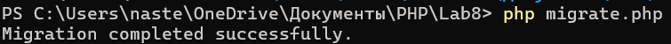
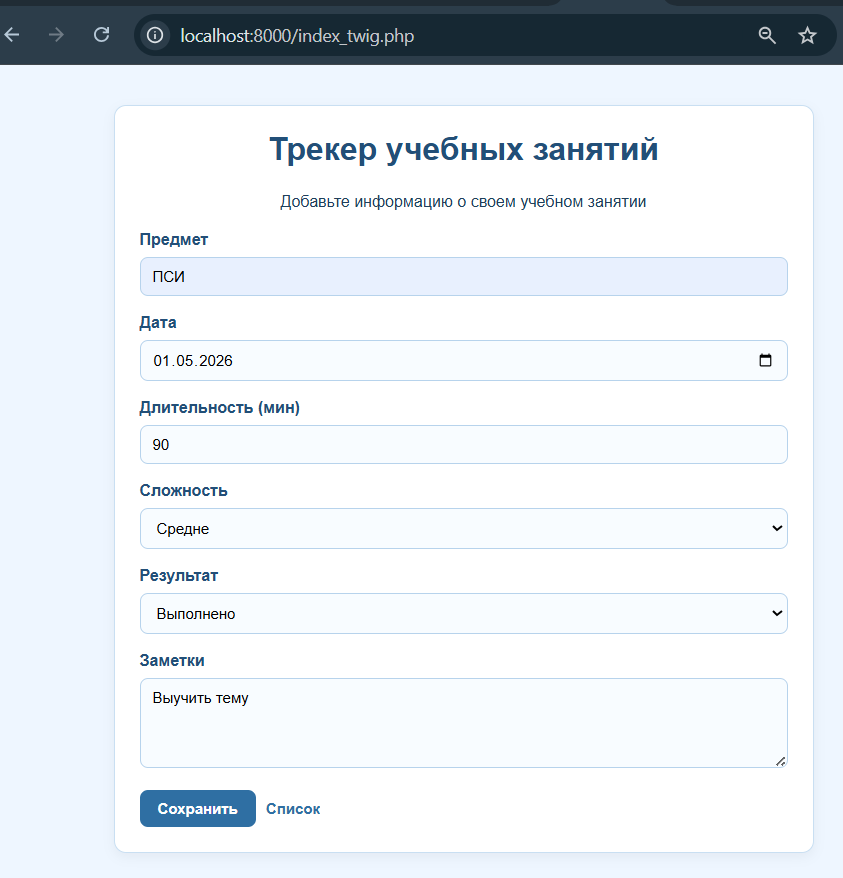
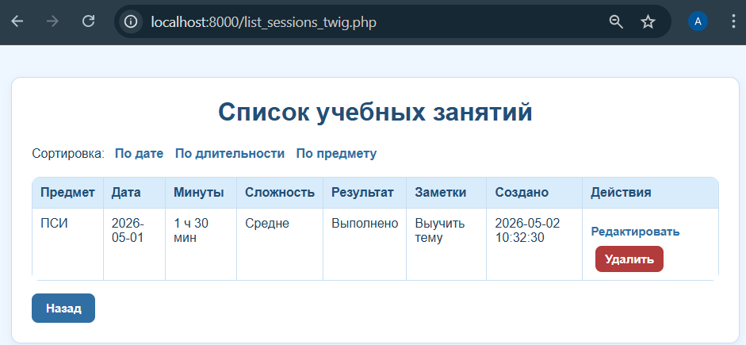
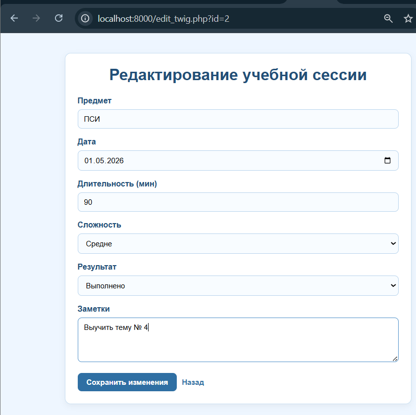
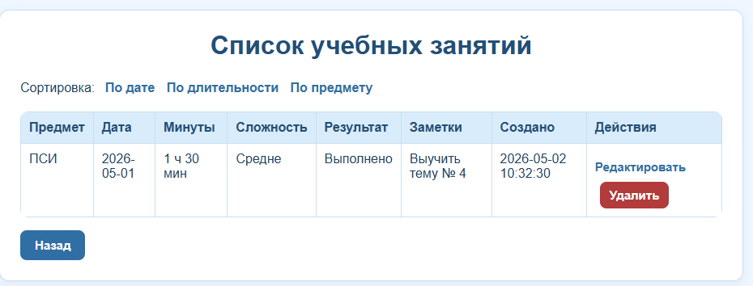
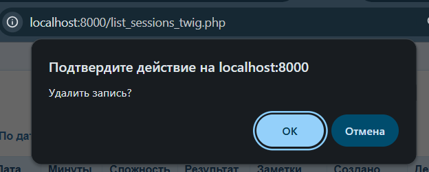
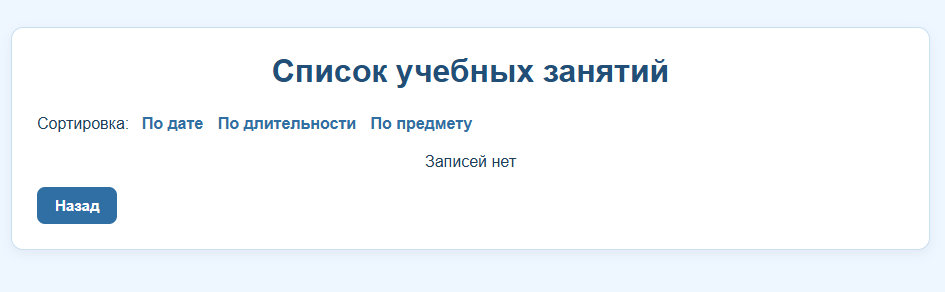

# Лабораторная работа №8. Работа с базой данных
Каварналы Анастасия IA2403

## Цель работы

Освоить работу с реляционными базами данных в PHP с использованием PDO. Перенести хранение данных из файлов в базу данных, реализовать полный цикл операций CRUD: создание, чтение, обновление и удаление записей

## Задание

Продолжите разработку проекта из лабораторной работы №7. Замените хранение данных в файле data.json на реляционную базу данных

## Ход работы

### 1. Создание базы данных

Для хранения данных проекта была создана реляционная база данных `PostgreSQL`

**В лабораторной работе используются две таблицы:**

- `subjects` - таблица предметов;
- `study_sessions` - таблица учебных занятий

Между таблицами реализована связь `один ко многим`:

Один предмет может быть связан с несколькими учебными занятиями
`subjects.id → study_sessions.subject_id`

То есть таблица `subjects` хранит название предмета, а таблица `study_sessions` хранит сами учебные занятия и ссылается на предмет через внешний ключ `subject_id`

Для запуска PostgreSQL использовался Docker-контейнер:

```powershell
docker run --name lab8-postgres -e POSTGRES_DB=lab8_db -e POSTGRES_USER=lab8_user -e POSTGRES_PASSWORD=lab8_pass -p 5432:5432 -d postgres:16
```

Для создания таблиц был добавлен файл `migrate.php`

```php
<?php

declare(strict_types=1);

require_once __DIR__ . '/src/Database.php';

$pdo = Database::getConnection();

$pdo->exec("
    CREATE TABLE IF NOT EXISTS subjects (
        id SERIAL PRIMARY KEY,
        name VARCHAR(255) NOT NULL UNIQUE
    );
");

$pdo->exec("
    CREATE TABLE IF NOT EXISTS study_sessions (
        id SERIAL PRIMARY KEY,
        subject_id INTEGER NOT NULL,
        study_date DATE NOT NULL,
        duration INTEGER NOT NULL,
        difficulty VARCHAR(100) NOT NULL,
        result TEXT NOT NULL,
        notes TEXT,
        created_at TIMESTAMP NOT NULL DEFAULT CURRENT_TIMESTAMP,
        updated_at TIMESTAMP NULL,
        CONSTRAINT fk_study_sessions_subject
            FOREIGN KEY (subject_id)
            REFERENCES subjects(id)
            ON DELETE RESTRICT
    );
");

echo 'Migration completed successfully.';
```

Миграция запускается командой:

```powershell
php migrate.php
```



### 2. Подключение к базе данных

Для подключения к базе данных был создан отдельный файл конфигурации `config.php`, где хранятся параметры подключения к PostgreSQL: адрес сервера, порт, имя базы данных, пользователь и пароль.

Файл `config.php`:

```php
<?php

return [
    'database' => [
        'dsn' => 'pgsql:host=localhost;port=5432;dbname=lab8_db',
        'username' => 'lab8_user',
        'password' => 'lab8_pass',
        'options' => [
            PDO::ATTR_ERRMODE => PDO::ERRMODE_EXCEPTION,
            PDO::ATTR_DEFAULT_FETCH_MODE => PDO::FETCH_ASSOC,
        ],
    ],
];
```

Для самого подключения был создан класс Database в файле `src/Database.php`

Этот класс отвечает за подключение к базе данных через PDO и возвращает готовый объект подключения

Файл `src/Database.php`:

```php
<?php

declare(strict_types=1);

/**
 * Класс Database
 *
 * Отвечает за подключение к базе данных PostgreSQL через PDO.
 */
class Database
{
    private static ?PDO $connection = null;

    /**
     * Возвращает объект подключения к базе данных.
     *
     * Если подключение уже было создано ранее, метод возвращает существующее подключение.
     * Если подключения ещё нет, метод создаёт новое подключение на основе настроек из config.php.
     *
     * @return PDO Объект подключения к базе данных.
     */
    public static function getConnection(): PDO
    {
        if (self::$connection === null) {
            $config = require __DIR__ . '/../config.php';
            $databaseConfig = $config['database'];

            self::$connection = new PDO(
                $databaseConfig['dsn'],
                $databaseConfig['username'],
                $databaseConfig['password'],
                $databaseConfig['options']
            );
        }

        return self::$connection;
    }
}
```

В данном решении используется PDO, потому что он позволяет работать с базой данных через единый интерфейс и поддерживает подготовленные SQL-запросы.
Класс `Database` создаёт подключение только один раз и повторно использует его при следующих обращениях к базе данных

### 3. Реализация CRUD-операций

Для выполнения CRUD-операций был обновлён файл `src/functions.php`

В нём были реализованы функции с названиями, указанными в условии лабораторной работы:

- `createRecord($data)` - добавление новой записи;
- `getAllRecords()` - получение всех записей;
- `getRecordById($id)` - получение одной записи по ID;
- `updateRecord($id, $data)` - обновление существующей записи;
- `deleteRecord($id)` - удаление записи по ID;
- `searchRecords($query)` - поиск записей по ключевым словам.

Сами SQL-запросы выполняются в классе `StudySessionRepository`, а функции из `src/functions.php` вызывают методы этого класса. Такой подход позволяет оставить в проекте функции из условия задания и одновременно использовать объектно-ориентированную структуру

```php
/**
 * Создаёт новую запись учебной сессии.
 *
 * @param array $data Данные записи.
 * @return int ID созданной записи.
 */
function createRecord(array $data): int
{
    return getRepository()->create($data);
}

/**
 * Возвращает все записи учебных сессий.
 *
 * @return array Список всех записей.
 */
function getAllRecords(): array
{
    return getRepository()->getAll();
}

/**
 * Возвращает одну запись по ID.
 *
 * Если запись с указанным ID не найдена, возвращается null.
 *
 * @param int $id ID записи.
 * @return array|null Данные записи или null, если запись не найдена.
 */
function getRecordById(int $id): ?array
{
    return getRepository()->find($id);
}

/**
 * Обновляет существующую запись учебной сессии.
 *
 * @param int $id ID записи.
 * @param array $data Новые данные записи.
 * @return bool Результат обновления.
 */
function updateRecord(int $id, array $data): bool
{
    return getRepository()->update($id, $data);
}

/**
 * Удаляет запись учебной сессии по ID.
 *
 * @param int $id ID записи.
 * @return bool Результат удаления.
 */
function deleteRecord(int $id): bool
{
    return getRepository()->delete($id);
}

/**
 * Выполняет поиск записей по ключевому слову.
 *
 * Поиск выполняется по предмету, сложности, результату и заметкам.
 *
 * @param string $query Поисковый запрос.
 * @return array Найденные записи.
 */
function searchRecords(string $query): array
{
    return getRepository()->search($query);
}
```

Функция `searchRecords($query)` была реализована как дополнительная возможность, так как в условии она указана как опциональная

Для связи функций с базой данных используется функция `getRepository()`:

```php
/**
 * Возвращает объект репозитория для работы с учебными сессиями.
 *
 * Репозиторий используется для выполнения операций с базой данных:
 * добавления, получения, обновления, удаления и поиска записей.
 *
 * @return StudySessionRepository Репозиторий учебных сессий.
 */
function getRepository(): StudySessionRepository
{
    static $repository = null;

    if ($repository === null) {
        $repository = new StudySessionRepository(Database::getConnection());
    }

    return $repository;
}
```

### 4. Обновление интерфейса

Для поддержки новых CRUD-операций были обновлены нативные PHP-шаблоны и Twig-шаблоны

На странице списка записей для каждой учебной сессии были добавлены действия:

- `Редактировать` - переход на страницу редактирования записи;
- `Удалить` - удаление записи через форму с методом `POST`

**Обновление списка записей**

В шаблоне `templates/list.php` была добавлена колонка `Действия`

```php
<th>Действия</th>
```

В этой колонке для каждой записи выводится ссылка Редактировать, которая передаёт ID записи в файл `edit.php`

```php
<a href="edit.php?id=<?= h($item['id']) ?>" class="btn btn-secondary">
    Редактировать
</a>
```

Также рядом с каждой записью добавлена кнопка `Удалить`

Удаление выполняется через форму с методом `POST`:

```php
<form action="delete.php" method="POST" class="inline-form">
    <input type="hidden" name="csrf_token" value="<?= h($csrf_token) ?>">
    <input type="hidden" name="id" value="<?= h($item['id']) ?>">

    <button
        type="submit"
        class="btn btn-danger"
        onclick="return confirm('Удалить запись?')"
    >
        Удалить
    </button>
</form>
```

Таким образом, рядом с каждой записью появились кнопки редактирования и удаления

**Страница редактирования записи**

Для редактирования была создана страница `edit.php`

Страница получает `id` записи из `GET`- или `POST`- запроса, проверяет его корректность и загружает данные записи из базы данных:

```php
$id = filter_input(INPUT_GET, 'id', FILTER_VALIDATE_INT)
    ?: filter_input(INPUT_POST, 'id', FILTER_VALIDATE_INT);

if (!$id) {
    render('errors', [
        'title' => 'Ошибка',
        'errors' => ['Некорректный ID записи.']
    ]);
    exit;
}

$session = getRecordById($id);
```

Если запись не найдена, пользователю выводится сообщение об ошибке:

```php
if (!$session) {
    render('errors', [
        'title' => 'Ошибка',
        'errors' => ['Запись не найдена.']
    ]);
    exit;
}
```

Если форма была отправлена методом POST, сначала выполняется проверка CSRF-токена:

```php
if (!checkCsrfToken($_POST['csrf_token'] ?? null)) {
    render('errors', [
        'title' => 'Ошибка',
        'errors' => ['Ошибка CSRF-защиты.']
    ]);
    exit;
}
```

После этого данные проходят ту же валидацию, что и при создании записи:

```php
$validator = new StudySessionValidator();
$errors = $validator->validate($_POST);
```

Если данные заполнены неправильно, форма редактирования открывается повторно и показывает ошибки:

```php
if (!empty($errors)) {
    render('edit', [
        'title' => 'Редактирование записи',
        'session' => array_merge($session, $_POST),
        'errors' => $errors,
        'csrf_token' => csrfToken()
    ]);
    exit;
}
```

Если ошибок нет, данные подготавливаются и запись обновляется в базе данных:

```php
$data = prepareSessionData($_POST);
updateRecord($id, $data);

header('Location: list_sessions.php');
exit;
```

После успешного обновления пользователь перенаправляется на страницу списка записей `list_sessions.php`

В условии указано перенаправление на список записей. В данном проекте страницей списка является `list_sessions.php`, поэтому после успешного редактирования пользователь перенаправляется именно на неё

**Шаблон редактирования**

Для отображения формы редактирования был создан шаблон `templates/edit.php`

В начале шаблона задаются значения по умолчанию для переменных, которые передаются из файла `edit.php`:

```php
<?php
$session = $session ?? [];
$errors = $errors ?? [];
$csrf_token = $csrf_token ?? '';
?>
```

Если при редактировании были найдены ошибки, они выводятся над формой:

```php
<?php if (!empty($errors)): ?>
    <ul class="error-list">
        <?php foreach ($errors as $error): ?>
            <li><?= h($error) ?></li>
        <?php endforeach; ?>
    </ul>
<?php endif; ?>
```

Форма редактирования отправляет данные обратно в `edit.php` методом `POST`

Также в форму добавлены скрытые поля с CSRF-токеном и ID редактируемой записи:

```php
<form action="edit.php" method="POST" class="form">
    <input type="hidden" name="csrf_token" value="<?= h($csrf_token) ?>">
    <input type="hidden" name="id" value="<?= h($session['id']) ?>">
```

Поля формы автоматически заполняются текущими данными записи из базы данных:

```php
<input
    type="text"
    name="subject"
    value="<?= h($session['subject']) ?>"
    required
    minlength="2"
    maxlength="100"
>
<input
    type="date"
    name="study_date"
    value="<?= h($session['study_date']) ?>"
    required
>
```

Для выпадающих списков используется проверка текущего значения. Благодаря этому в форме сразу выбран тот вариант, который уже сохранён в базе данных:

```php
<option value="Легко" <?= $session['difficulty'] === 'Легко' ? 'selected' : '' ?>>
    Легко
</option>
<option value="Средне" <?= $session['difficulty'] === 'Средне' ? 'selected' : '' ?>>
    Средне
</option>
<option value="Сложно" <?= $session['difficulty'] === 'Сложно' ? 'selected' : '' ?>>
    Сложно
</option>
```

После изменения данных пользователь нажимает кнопку `Сохранить изменения`, и форма отправляется на обработку:

```php
<div class="actions">
    <button type="submit" class="btn">Сохранить изменения</button>
    <a href="list_sessions.php" class="btn btn-secondary">Назад</a>
</div>
```

**Обновление Twig-шаблонов**

Также были обновлены Twig-шаблоны. В файле `templates_twig/list.twig` для каждой записи были добавлены действия `Редактировать` и `Удалить`.

Ссылка редактирования ведёт на страницу `edit_twig.php` и передаёт ID записи:

```twig
<a href="edit_twig.php?id={{ item.id }}" class="btn btn-secondary">
    Редактировать
</a>
```

Удаление в Twig-версии также выполняется через форму с методом `POST`:

```twig
<form action="delete_twig.php" method="POST" class="inline-form">
    <input type="hidden" name="csrf_token" value="{{ csrf_token }}">
    <input type="hidden" name="id" value="{{ item.id }}">

    <button
        type="submit"
        class="btn btn-danger"
        onclick="return confirm('Удалить запись?')"
    >
        Удалить
    </button>
</form>
```

Для редактирования в Twig-версии были добавлены файлы `edit_twig.php` и `templates_twig/edit.twig`

Файл `edit_twig.php` получает запись по ID, передаёт данные в шаблон редактирования, а после отправки формы проверяет данные и обновляет запись в базе данных:

```php
$session = getRecordById($id);

echo $twig->render('edit.twig', [
    'session' => $session,
    'errors' => [],
    'csrf_token' => csrfToken()
]);
```

После отправки формы используется та же валидация, что и при создании записи:

```php
$validator = new StudySessionValidator();
$errors = $validator->validate($_POST);
```

Если ошибок нет, запись обновляется в базе данных, после чего пользователь перенаправляется на список Twig-версии:

```php
$data = prepareSessionData($_POST);
updateRecord($id, $data);

header('Location: list_sessions_twig.php');
exit;
```

### 5. Безопасность

Для повышения безопасности проекта были выполнены два действия:

- SQL-запросы с пользовательскими данными выполняются через подготовленные выражения PDO;
- для форм создания, редактирования и удаления добавлена CSRF-защита

**Защита от SQL-инъекций**

Все SQL-запросы, в которые передаются данные пользователя, выполняются через `prepare()` и `execute()`

Это защищает приложение от SQL-инъекций, потому что пользовательские данные не вставляются напрямую в SQL-строку

Пример добавления записи в `StudySessionRepository.php`:

```php
$stmt = $this->pdo->prepare("
    INSERT INTO study_sessions 
        (subject_id, study_date, duration, difficulty, result, notes, created_at)
    VALUES 
        (:subject_id, :study_date, :duration, :difficulty, :result, :notes, :created_at)
    RETURNING id
");

$stmt->execute([
    'subject_id' => $subjectId,
    'study_date' => $data['study_date'],
    'duration' => $data['duration'],
    'difficulty' => $data['difficulty'],
    'result' => $data['result'],
    'notes' => $data['notes'],
    'created_at' => $data['created_at'] ?? date('Y-m-d H:i:s'),
]);
```

**Пример удаления записи:**

```php
$stmt = $this->pdo->prepare("
    DELETE FROM study_sessions
    WHERE id = :id
");

return $stmt->execute([
    'id' => $id,
]);
```

В этих примерах значения `subject_id`, `study_date`, `duration`, `difficulty`, `result`, `notes`, `created_at` и `id` передаются через параметры. Это делает SQL-запросы безопаснее и защищает приложение от SQL-инъекций

**CSRF-защита**

Для форм создания, редактирования и удаления была добавлена CSRF-защита.  
В файле `src/functions.php` используются функции создания и проверки токена:

```php
function csrfToken(): string
{
    if (empty($_SESSION['csrf_token'])) {
        $_SESSION['csrf_token'] = bin2hex(random_bytes(32));
    }

    return $_SESSION['csrf_token'];
}

function checkCsrfToken(?string $token): bool
{
    return is_string($token)
        && isset($_SESSION['csrf_token'])
        && hash_equals($_SESSION['csrf_token'], $token);
}
```

CSRF-токен добавляется в формы через скрытое поле:

```php
<input type="hidden" name="csrf_token" value="<?= h($csrf_token) ?>">
```

В Twig-шаблоне токен добавляется так:

```twig
<input type="hidden" name="csrf_token" value="{{ csrf_token }}">
```

Перед выполнением действия токен проверяется. Если токен отсутствует или неправильный, действие не выполняется

### 6. Дополнительное задание

Для выполнения дополнительного задания в проект была добавлена объектно-ориентированная структура

Работа с базой данных была вынесена в отдельные классы, чтобы код был более понятным и удобным для поддержки

**В проекте используются следующие классы:**

- `Database` - отвечает за подключение к базе данных PostgreSQL через PDO;
- `StudySessionRepository` - отвечает за работу с учебными сессиями в базе данных: добавление, получение, редактирование, удаление и поиск записей

Такой подход позволяет разделить ответственность между файлами: класс `Database` отвечает только за подключение к базе данных, а класс `StudySessionRepository` содержит методы для добавления, получения, обновления, удаления и поиска записей.

**Класс Database**

Файл `src/Database.php`:

```php
class Database
{
    private static ?PDO $connection = null;

    public static function getConnection(): PDO
    {
        if (self::$connection === null) {
            $config = require __DIR__ . '/../config.php';
            $databaseConfig = $config['database'];

            self::$connection = new PDO(
                $databaseConfig['dsn'],
                $databaseConfig['username'],
                $databaseConfig['password'],
                $databaseConfig['options']
            );
        }

        return self::$connection;
    }
}
```

Класс `Database` создаёт подключение к базе данных один раз и возвращает объект PDO для дальнейшей работы

**Класс StudySessionRepository**

Файл `src/StudySessionRepository.php` содержит методы для работы с учебными сессиями:

- `create()` - добавление записи;
- `getAll()` - получение всех записей;
- `find()` - получение одной записи по ID;
- `update()` - обновление записи;
- `delete()` - удаление записи;
- `search()` - поиск записей

**Пример метода добавления записи:**

```php
public function create(array $data): int
{
    $subjectId = $this->getOrCreateSubjectId($data['subject']);

    $stmt = $this->pdo->prepare("
        INSERT INTO study_sessions 
            (subject_id, study_date, duration, difficulty, result, notes, created_at)
        VALUES 
            (:subject_id, :study_date, :duration, :difficulty, :result, :notes, :created_at)
        RETURNING id
    ");

    $stmt->execute([
        'subject_id' => $subjectId,
        'study_date' => $data['study_date'],
        'duration' => $data['duration'],
        'difficulty' => $data['difficulty'],
        'result' => $data['result'],
        'notes' => $data['notes'],
        'created_at' => $data['created_at'] ?? date('Y-m-d H:i:s'),
    ]);

    return (int)$stmt->fetchColumn();
}
```

Также в проекте была реализована собственная миграция в файле `migrate.php`. Она создаёт таблицы `subjects` и `study_sessions`, а также связь между ними. Код миграции был приведён в первом шаге работы, где описывалось создание базы данных

В результате код стал более структурированным: подключение к базе данных, работа с записями и отображение интерфейса разделены между разными файлами

### 7. Проверка работы проекта

Сначала была открыта страница `index_twig.php` с формой добавления учебной сессии. В форму были введены данные: предмет, дата, длительность, сложность, результат и заметки



После нажатия кнопки `Сохранить` запись была добавлена в базу данных и отобразилась на странице `list_sessions_twig.php`



Затем была проверена операция редактирования. Для записи была нажата кнопка `Редактировать`, после чего открылась страница `edit_twig.php?id=2`. В форме редактирования автоматически отобразились данные выбранной записи



После изменения заметки и нажатия кнопки `Сохранить изменения` запись была обновлена в базе данных. На странице списка отобразились уже изменённые данные



Также была проверена операция удаления. При нажатии кнопки `Удалить` появилось окно подтверждения действия



После подтверждения запись была удалена из базы данных, и на странице списка появилось сообщение `Записей нет`



Таким образом, были проверены основные CRUD-операции:

- добавление записи;
- отображение записи в списке;
- редактирование записи;
- сохранение изменений;
- удаление записи через POST-форму

Проверка показала, что Twig-версия интерфейса корректно работает с базой данных PostgreSQL

## Контрольные вопросы

### 1. Что такое PDO и чем он отличается от устаревших расширений `mysqli_*`?

**PDO** - это встроенный механизм PHP для работы с базами данных. Он позволяет подключаться к разным СУБД через единый интерфейс

Главное отличие в том, что `PDO` может работать с разными базами данных, например PostgreSQL, MySQL, SQLite и другими. А `mysqli_*` предназначен только для MySQL

Также `PDO` удобно использовать с подготовленными выражениями, что помогает безопасно передавать данные в SQL-запросы и защищать приложение от SQL-инъекций

### 2. Что такое подготовленные выражения и зачем они нужны? Как они защищают от SQL-инъекций?

**Подготовленные выражения** - это способ выполнить SQL-запрос так, чтобы сам запрос и данные пользователя передавались отдельно

Сначала создаётся SQL-запрос с параметрами:

```php
$stmt = $pdo->prepare("SELECT * FROM study_sessions WHERE id = :id");
```

Потом отдельно передаются значения:

```php
$stmt->execute([
    'id' => $id,
]);
```

Это защищает от SQL-инъекций, потому что данные пользователя не вставляются напрямую в SQL-строку. База данных воспринимает их как обычные значения, а не как часть SQL-команды

### 3. Что такое транзакция в базе данных? В каких ситуациях её стоит использовать?

**Транзакция** - это набор операций с базой данных, которые должны выполниться полностью или не выполниться вообще

Например, если нужно выполнить несколько связанных запросов, и ошибка в одном из них делает остальные бессмысленными, лучше использовать транзакцию

Пример ситуации: нужно создать предмет и сразу добавить учебную сессию. Если предмет создался, а учебная сессия не добавилась из-за ошибки, база может оказаться в неправильном состоянии. Транзакция позволяет откатить изменения и вернуть базу к прежнему состоянию

**Основные команды:**

```php
$pdo->beginTransaction();
// запросы
$pdo->commit();
```

Если произошла ошибка:

```php
$pdo->rollBack();
```

### 4. Чем отличается `fetch()` от `fetchAll()` в PDO?

`fetch()` и `fetchAll()` отличаются тем, сколько строк результата они возвращают

- `fetch()` возвращает только одну следующую строку из результата запроса. Его удобно использовать, когда нужно получить одну конкретную запись, например запись по ID

- `fetchAll()` возвращает все найденные строки сразу в виде массива. Его удобно использовать, когда нужно вывести список записей, например все учебные занятия в таблице

В моём проекте `fetch()` используется для получения одной записи при редактировании, а `fetchAll()` - для вывода списка всех учебных занятий

## Вывод

В ходе лабораторной работы был доработан проект из лабораторной работы №7: хранение данных было перенесено из файла `data.json` в базу данных PostgreSQL

Было настроено подключение к базе через PDO, созданы таблицы `subjects` и `study_sessions` со связью один ко многим. Также были реализованы CRUD-операции: добавление, просмотр, редактирование и удаление записей.

Нативные PHP-шаблоны и Twig-шаблоны были обновлены для работы с базой данных. Для защиты использованы подготовленные SQL-запросы и CSRF-токены

В результате проект стал более структурированным и теперь поддерживает полный цикл работы с учебными занятиями через базу данных

## Используемые источники

1. [Moodle](https://elearning.usm.md/course/view.php?id=7161)
2. [PDOStatement::fetchAll](https://www.php.net/manual/ru/pdostatement.fetchall.php)
3. [PHP Manual — PDO](https://www.php.net/manual/ru/book.pdo.php)
4. [PHP Manual — PDO::prepare](https://www.php.net/manual/ru/pdo.prepare.php?utm_source=chatgpt.com)
5. [PHP Manual — PDOStatement::execute](https://www.php.net/manual/ru/pdostatement.execute.php?utm_source=chatgpt.com)
6. [PHP Manual — Транзакции PDO](https://www.php.net/manual/ru/pdo.transactions.php)
7. [Twig Documentation — Templates](https://twig.symfony.com/doc/3.x/templates.html)
8. [Twig Documentation — Extends](https://twig.symfony.com/doc/3.x/tags/extends.html)